## Introduction

This paper seeks to understand how mortality risks from COVID for men and women differ by age, and how gender differences in mortality risk from COVID compare to gender differences in mortality risks from all-causes. 

## Data

This analyses in this paper use global excess deaths associated with COVID-19 (modeled estimates) produced by the [Technical Advisory Group (TAG) on COVID-19 mortality assessment](https://www.who.int/data/sets/global-excess-deaths-associated-with-covid-19-modelled-estimates). Estimates of expected all-cause deaths (baseline), actual cause deaths and excess deaths are provided by country and 7 age groups:"0-24" , "25-34" , 35-44", "45-54", "55-64", "65-74", "75-84", ">85".

Out of 195 countries in the WHO database, 75 countries have excess death estimates based on reported all-cause death records disaggregated by gender for 2020 and of these, 61 also use reported deaths by gender and age for 2021.

Inclusion criteria for this analysis are as follows: 

- Age groups at or above 45 years of age
- Countries with a total population of at least 1m 
- Countries with a cumulative official COVID-19 death toll of at least 2000 deaths at the end of 2020
- Countries with reported all-cause data disaggregated by age and sex in 2020
- The following 51 countries are included in this analysis: Argentina, Austria, Azerbaijan, Belgium, Bulgaria, Bosnia and Herzegovina, Bolivia (Plurinational State of), Brazil, Canada, Switzerland, Chile, Colombia, Costa Rica, Czechia, Germany, Dominican Republic, Ecuador, Egypt, Spain, France, The United Kingdom, Georgia, Greece, Guatemala, Croatia, Hungary, Ireland, Iran (Islamic Republic of), Iraq, Israel, Italy, Japan, Kazakhstan, Republic of Moldova, Mexico, Netherlands, Panama, Peru, Poland, Portugal, Paraguay, Romania, Russian Federation, Serbia, Slovakia, Slovenia, Sweden, Tunisia, Ukraine, USA, South Africa

## Results

### Sex-ratio in mortality (all-cause and excess in 2020): Observations

::: {.cell fig.asp='0.9'}
::: {.cell-output-display}
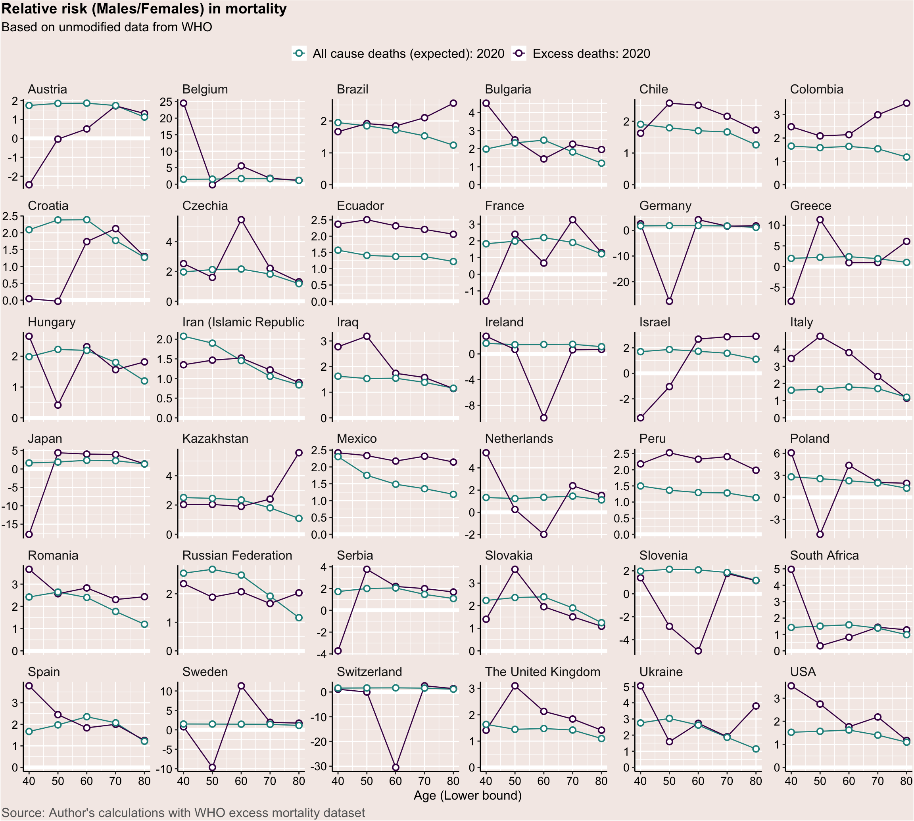{width=1152}
:::
:::


### Age-adjusted poisson model (with interaction)

::: {.cell fig.asp='1.4'}
::: {.cell-output-display}
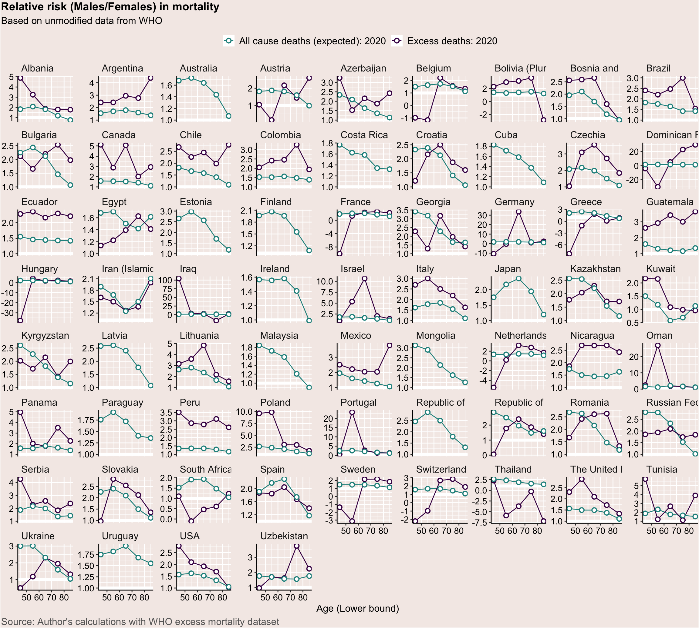{width=1152}
:::
:::


### Relationship between predicted sex-differences in mortality and country income

#### All available data (composition of countries changes in 2021)


::: {.cell fig.asp='0.818'}
::: {.cell-output-display}
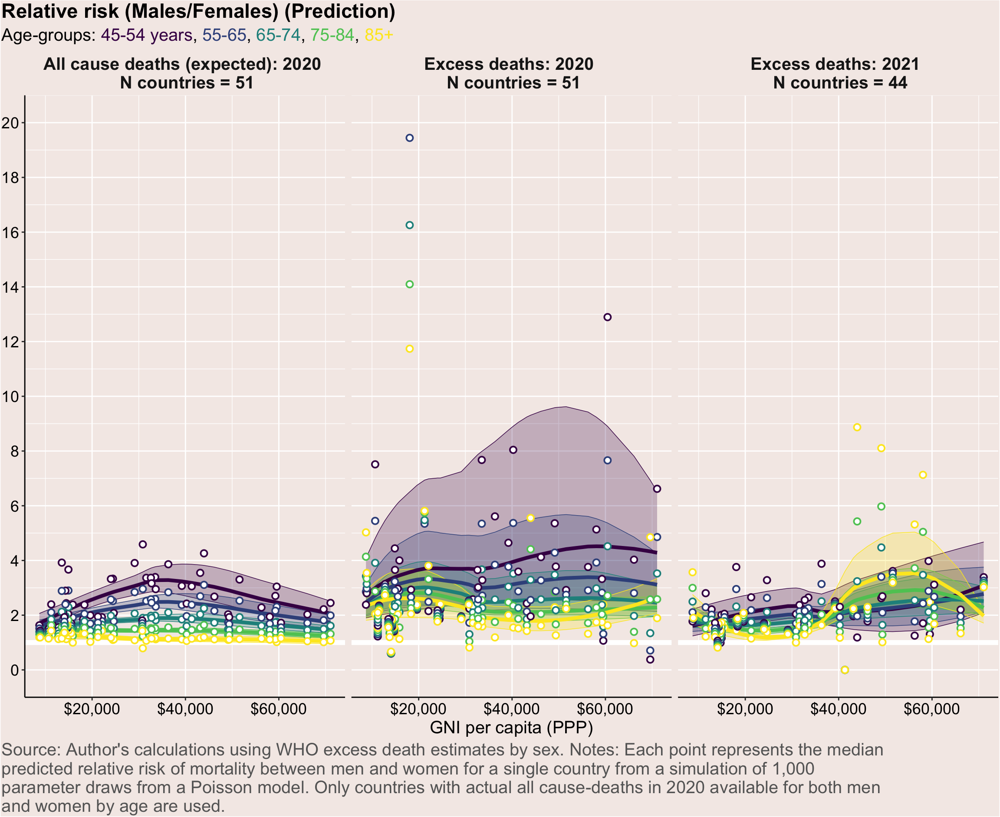{width=1152}
:::
:::


#### Keeping composition of countries constant (only countries with all cause deaths disaggregate by gender in 2020 & 2021)

::: {.cell fig.asp='0.818'}
::: {.cell-output-display}
{width=1152}
:::
:::


## Annex 

### By country

The following set of figures display observed and predicted values of mortality rates, the sex-ratio of mortality rates (males/females) and the sex-gap of mortality rates (males - females) by age, for each country in the analysis dataset. 


::: {.cell fig.asp='0.818'}

#### Argentina 
- Total population: 44,985,105 
- Total official COVID deaths in 2020 (Our World in Data): 48,271 
- Total official COVID deaths in 2021  (Our World in Data): 69,905 
- Total excess deaths in 2020  (WHO): 35,840.96 
- Total excess deaths in 2021  (WHO):  

::: {.cell-output-display}
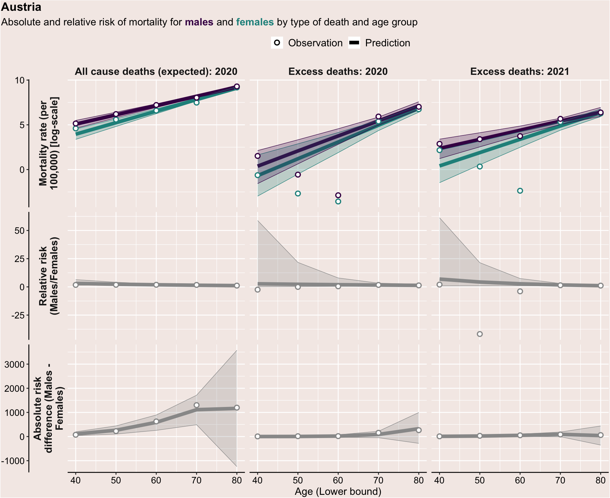{width=960}
:::


#### Austria 
- Total population: 8,888,592 
- Total official COVID deaths in 2020 (Our World in Data): 7,379 
- Total official COVID deaths in 2021  (Our World in Data): 9,319 
- Total excess deaths in 2020  (WHO): 8,087.427 
- Total excess deaths in 2021  (WHO): 7,886.081 

::: {.cell-output-display}
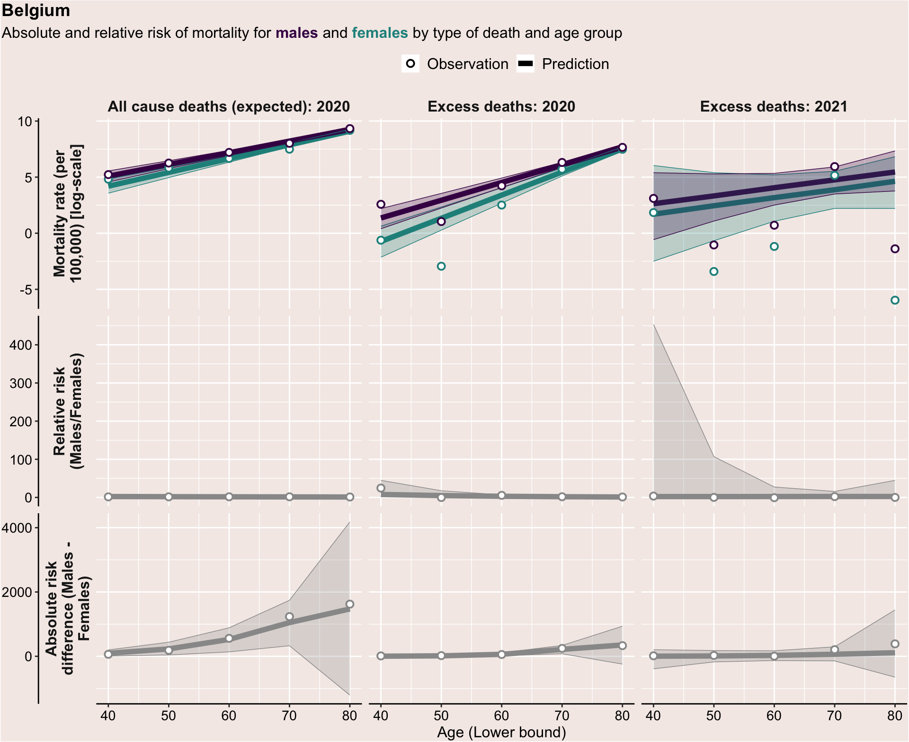{width=960}
:::


#### Azerbaijan 
- Total population: 10,282,158 
- Total official COVID deaths in 2020 (Our World in Data): 2,575 
- Total official COVID deaths in 2021  (Our World in Data): 5,771 
- Total excess deaths in 2020  (WHO): 12,039.15 
- Total excess deaths in 2021  (WHO): 21,581.59 

::: {.cell-output-display}
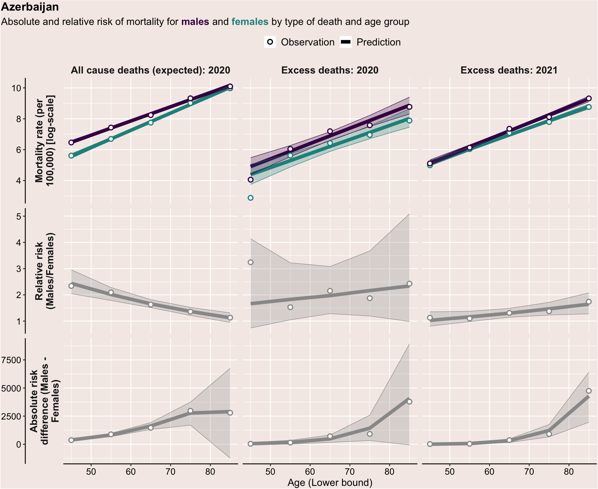{width=960}
:::


#### Belgium 
- Total population: 11,533,459 
- Total official COVID deaths in 2020 (Our World in Data): 19,674 
- Total official COVID deaths in 2021  (Our World in Data): 8,682 
- Total excess deaths in 2020  (WHO): 16,540.23 
- Total excess deaths in 2021  (WHO): 3,794.365 

::: {.cell-output-display}
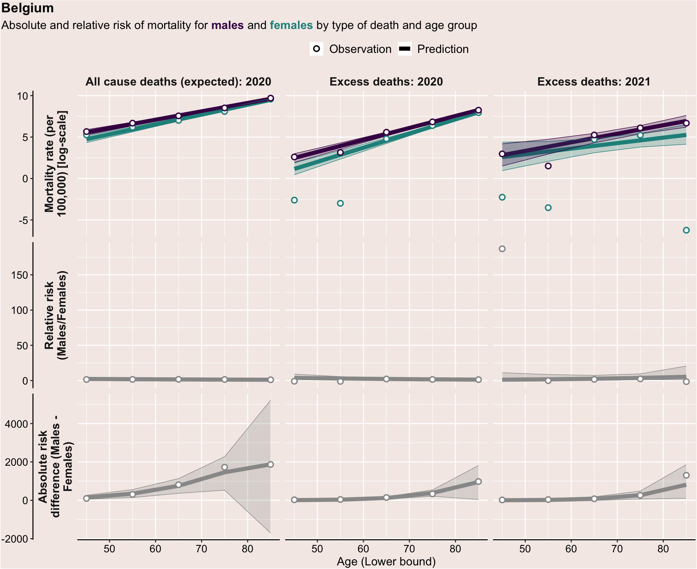{width=960}
:::


#### Bulgaria 
- Total population: 6,967,018 
- Total official COVID deaths in 2020 (Our World in Data): 7,515 
- Total official COVID deaths in 2021  (Our World in Data): 23,375 
- Total excess deaths in 2020  (WHO): 17,804.05 
- Total excess deaths in 2021  (WHO): 42,715.42 

::: {.cell-output-display}
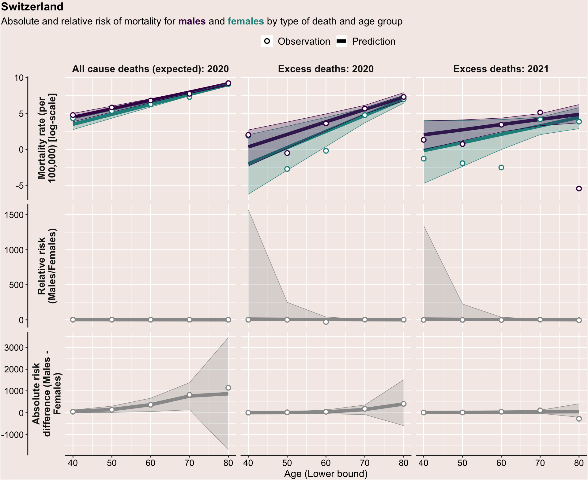{width=960}
:::


#### Bosnia and Herzegovina 
- Total population: 3,314,350 
- Total official COVID deaths in 2020 (Our World in Data): 4,050 
- Total official COVID deaths in 2021  (Our World in Data): 9,378 
- Total excess deaths in 2020  (WHO): 6,792.844 
- Total excess deaths in 2021  (WHO):  

::: {.cell-output-display}
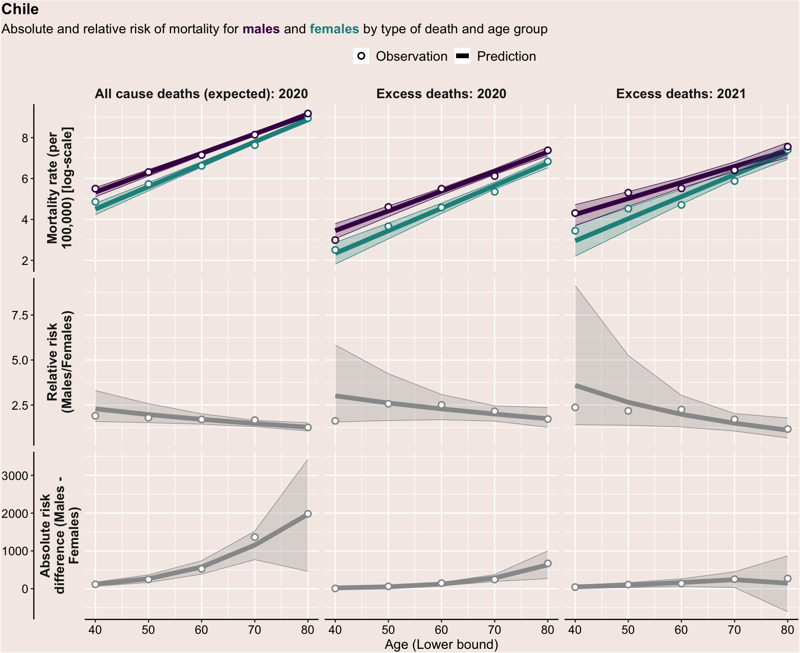{width=960}
:::


#### Bolivia (Plurinational State of) 
- Total population: 11,934,333 
- Total official COVID deaths in 2020 (Our World in Data): 9,135 
- Total official COVID deaths in 2021  (Our World in Data): 10,515 
- Total excess deaths in 2020  (WHO): 33,888.56 
- Total excess deaths in 2021  (WHO): 47,020.77 

::: {.cell-output-display}
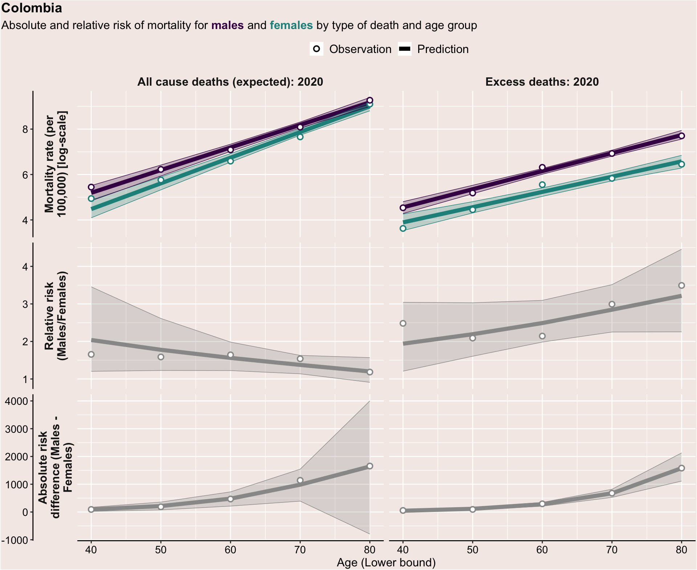{width=960}
:::


#### Brazil 
- Total population: 213,114,918 
- Total official COVID deaths in 2020 (Our World in Data): 192,681 
- Total official COVID deaths in 2021  (Our World in Data): 426,136 
- Total excess deaths in 2020  (WHO): 189,945.8 
- Total excess deaths in 2021  (WHO): 467,480.1 

::: {.cell-output-display}
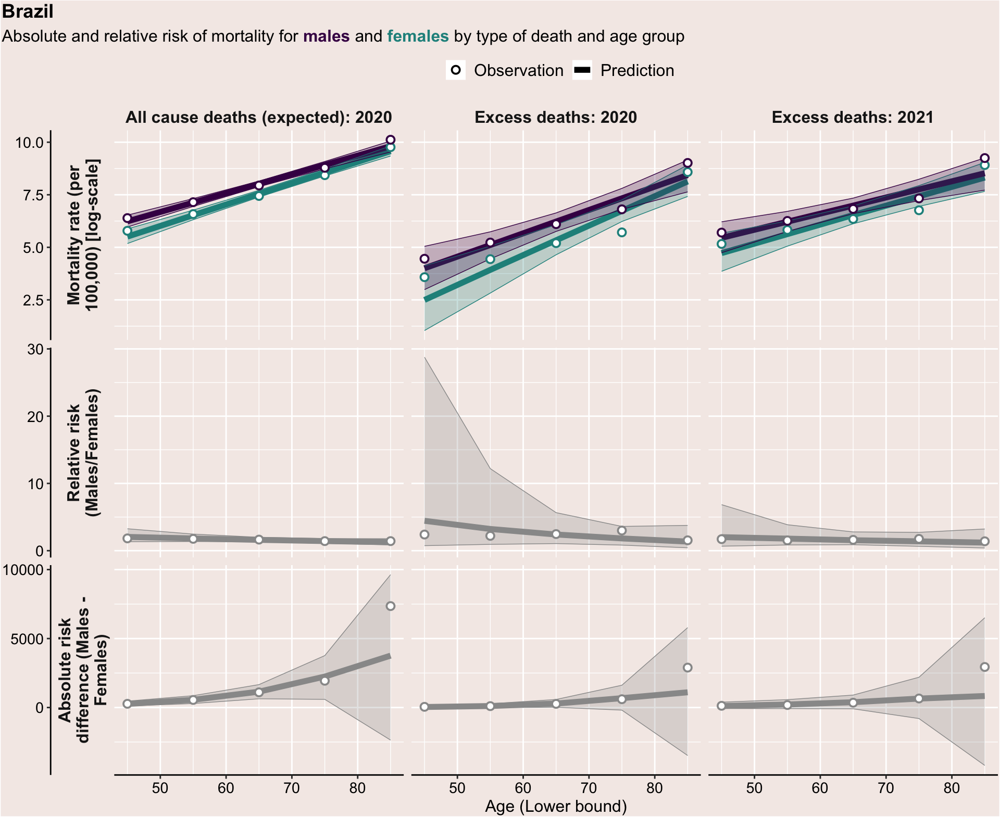{width=960}
:::


#### Canada 
- Total population: 37,818,806 
- Total official COVID deaths in 2020 (Our World in Data): 15,274 
- Total official COVID deaths in 2021  (Our World in Data): 14,684 
- Total excess deaths in 2020  (WHO): 14,551.54 
- Total excess deaths in 2021  (WHO): 11,949.19 

::: {.cell-output-display}
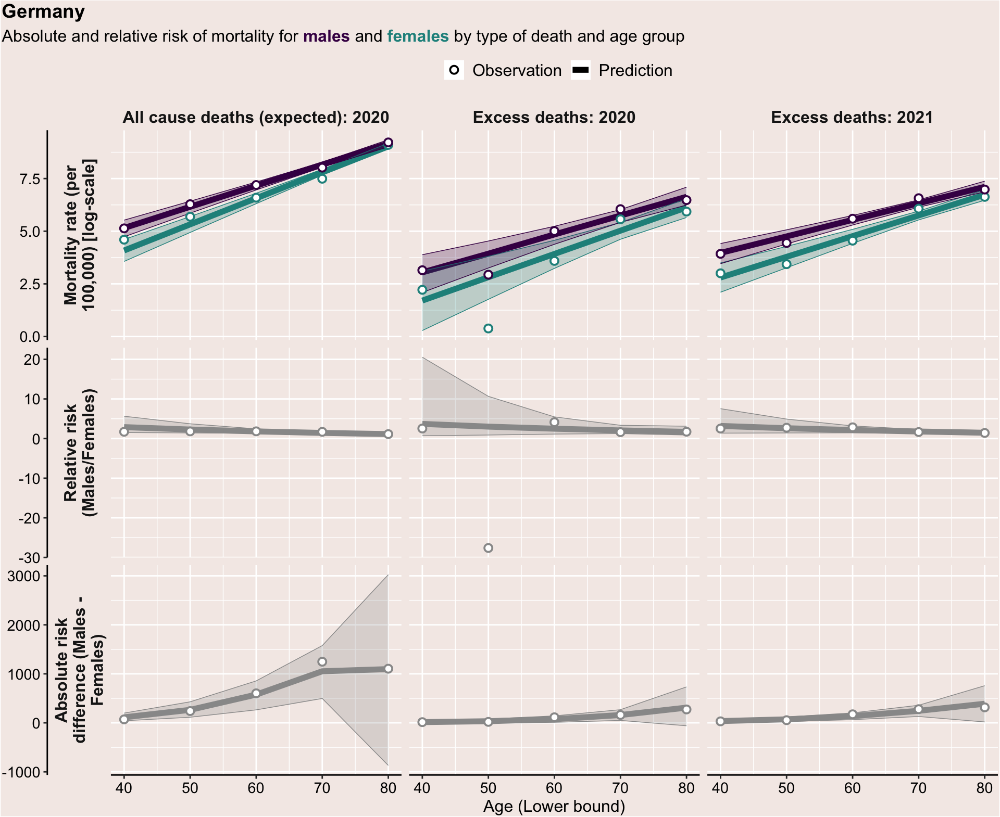{width=960}
:::


#### Switzerland 
- Total population: 8,619,390 
- Total official COVID deaths in 2020 (Our World in Data): 7,528 
- Total official COVID deaths in 2021  (Our World in Data): 4,393 
- Total excess deaths in 2020  (WHO): 8,808.004 
- Total excess deaths in 2021  (WHO): 3,683.951 

::: {.cell-output-display}
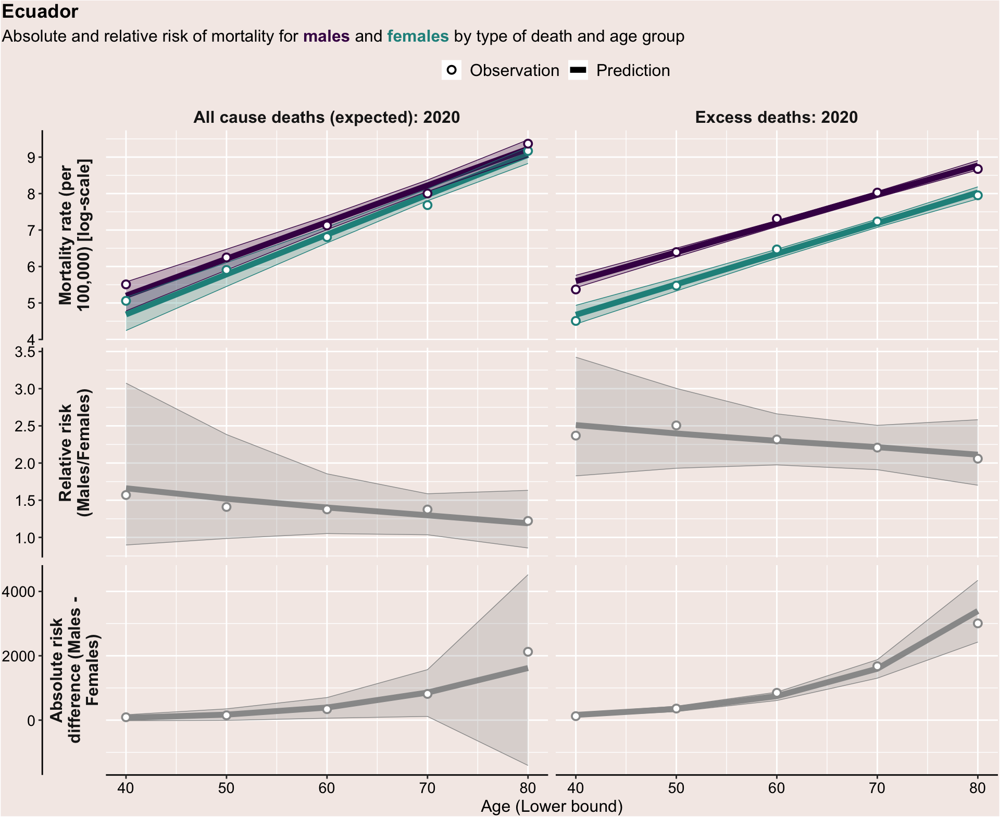{width=960}
:::


#### Chile 
- Total population: 19,276,612 
- Total official COVID deaths in 2020 (Our World in Data): 16,499 
- Total official COVID deaths in 2021  (Our World in Data): 22,597 
- Total excess deaths in 2020  (WHO): 14,771.02 
- Total excess deaths in 2021  (WHO): 23,894.96 

::: {.cell-output-display}
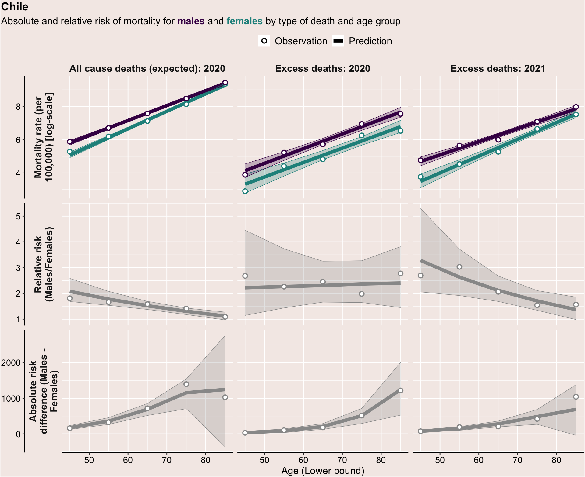{width=960}
:::


#### Colombia 
- Total population: 50,911,158 
- Total official COVID deaths in 2020 (Our World in Data): 42,620 
- Total official COVID deaths in 2021  (Our World in Data): 87,246 
- Total excess deaths in 2020  (WHO): 53,886.16 
- Total excess deaths in 2021  (WHO): 108,332.4 

::: {.cell-output-display}
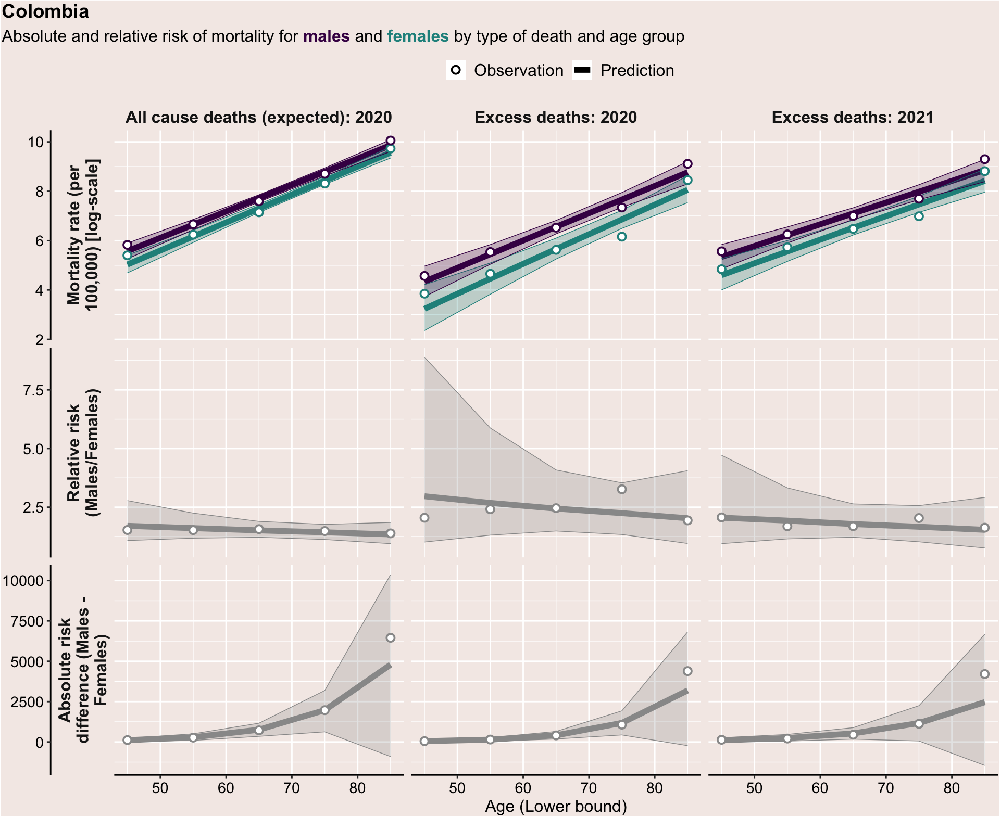{width=960}
:::


#### Costa Rica 
- Total population: 5,119,855 
- Total official COVID deaths in 2020 (Our World in Data): 2,156 
- Total official COVID deaths in 2021  (Our World in Data): 5,198 
- Total excess deaths in 2020  (WHO): 738.0506 
- Total excess deaths in 2021  (WHO): 4,704.336 

::: {.cell-output-display}
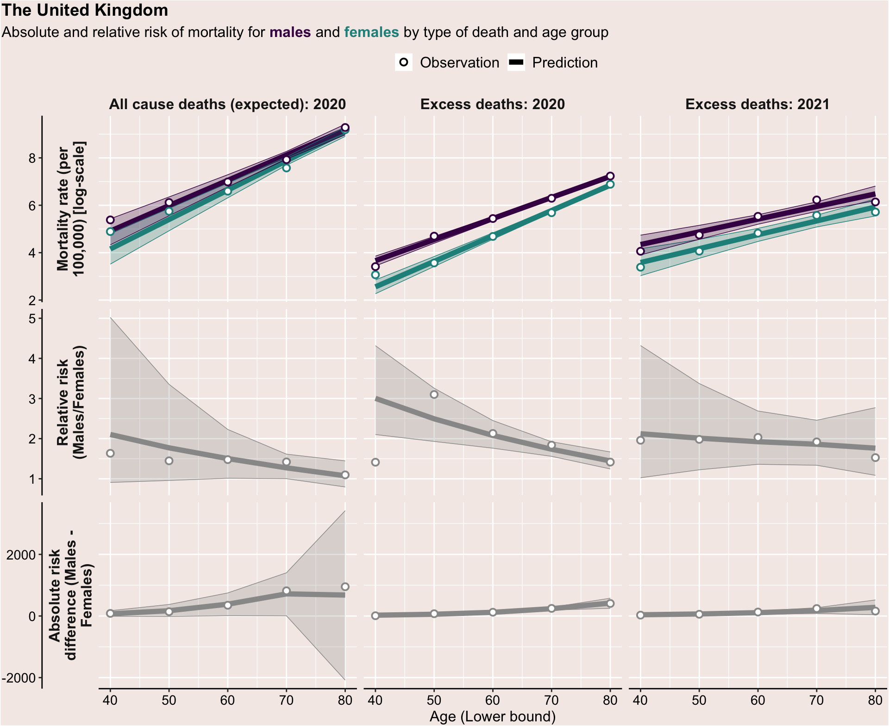{width=960}
:::


#### Czechia 
- Total population: 10,514,740 
- Total official COVID deaths in 2020 (Our World in Data): 11,888 
- Total official COVID deaths in 2021  (Our World in Data): 24,444 
- Total excess deaths in 2020  (WHO): 16,599.66 
- Total excess deaths in 2021  (WHO): 26,648.28 

::: {.cell-output-display}
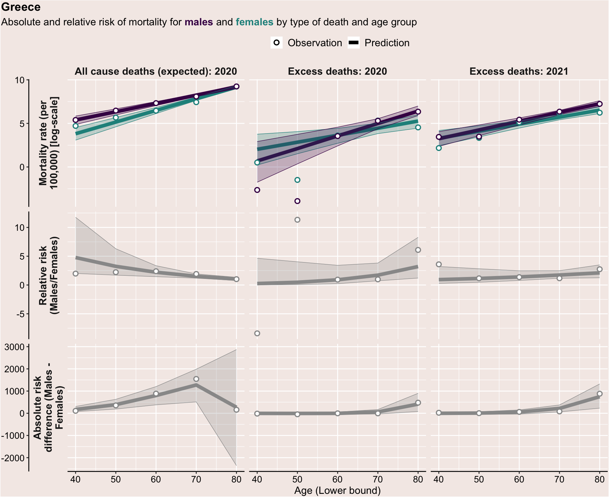{width=960}
:::


#### Germany 
- Total population: 83,116,786 
- Total official COVID deaths in 2020 (Our World in Data): 50,447 
- Total official COVID deaths in 2021  (Our World in Data): 68,023 
- Total excess deaths in 2020  (WHO): 34,514.19 
- Total excess deaths in 2021  (WHO): 66,990.79 

::: {.cell-output-display}
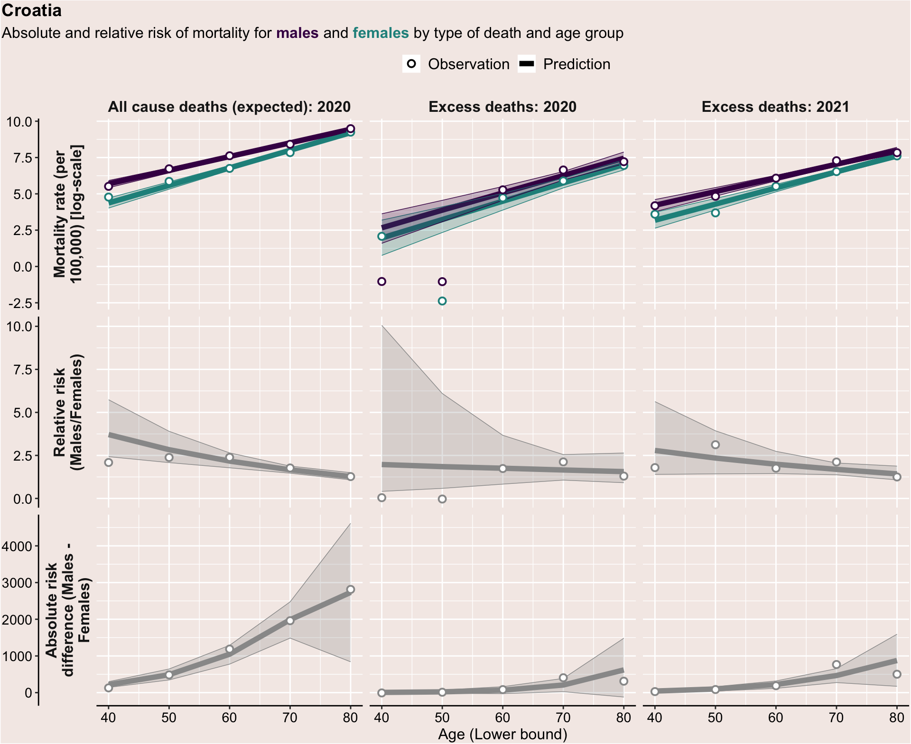{width=960}
:::


#### Dominican Republic 
- Total population: 10,994,170 
- Total official COVID deaths in 2020 (Our World in Data): 2,409 
- Total official COVID deaths in 2021  (Our World in Data): 1,837 
- Total excess deaths in 2020  (WHO): 2,333.078 
- Total excess deaths in 2021  (WHO): 6,689.009 

::: {.cell-output-display}
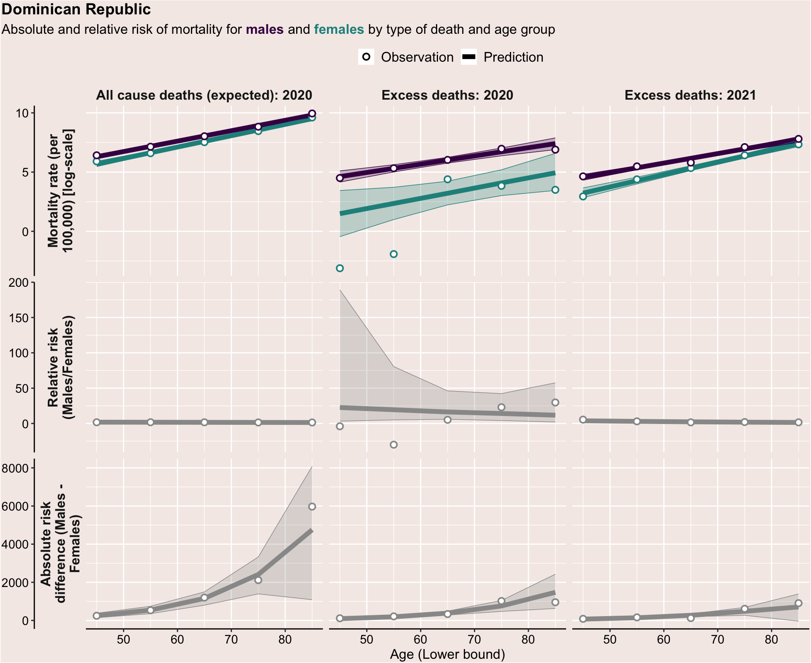{width=960}
:::


#### Ecuador 
- Total population: 17,580,085 
- Total official COVID deaths in 2020 (Our World in Data): 14,023 
- Total official COVID deaths in 2021  (Our World in Data): 19,646 
- Total excess deaths in 2020  (WHO): 46,706.66 
- Total excess deaths in 2021  (WHO): 32,874.78 

::: {.cell-output-display}
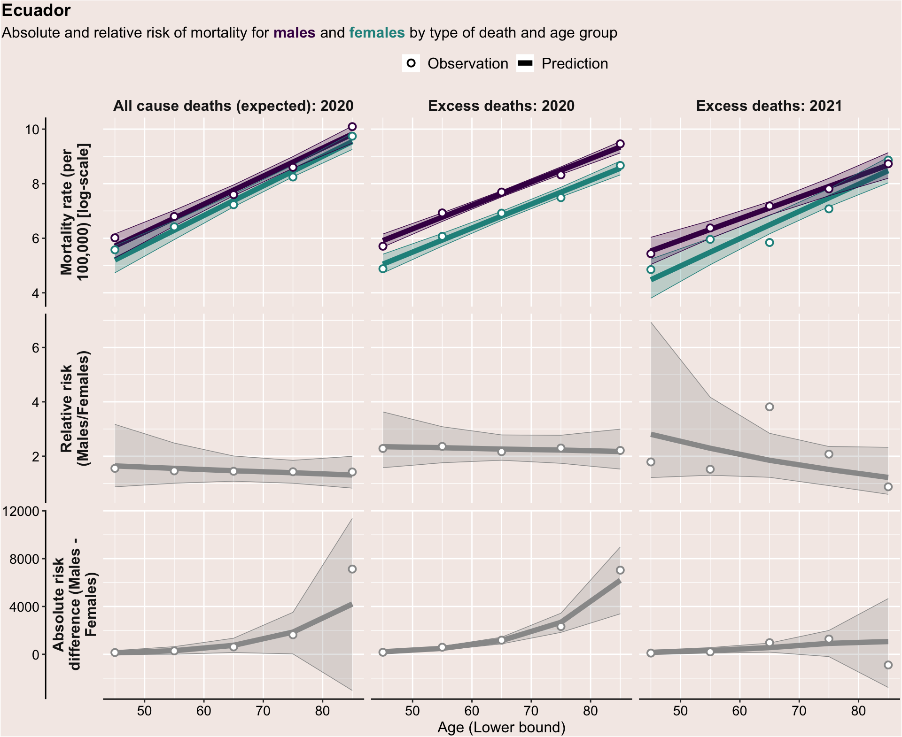{width=960}
:::


#### Egypt 
- Total population: 107,450,137 
- Total official COVID deaths in 2020 (Our World in Data): 7,520 
- Total official COVID deaths in 2021  (Our World in Data): 14,175 
- Total excess deaths in 2020  (WHO): 107,524 
- Total excess deaths in 2021  (WHO):  

::: {.cell-output-display}
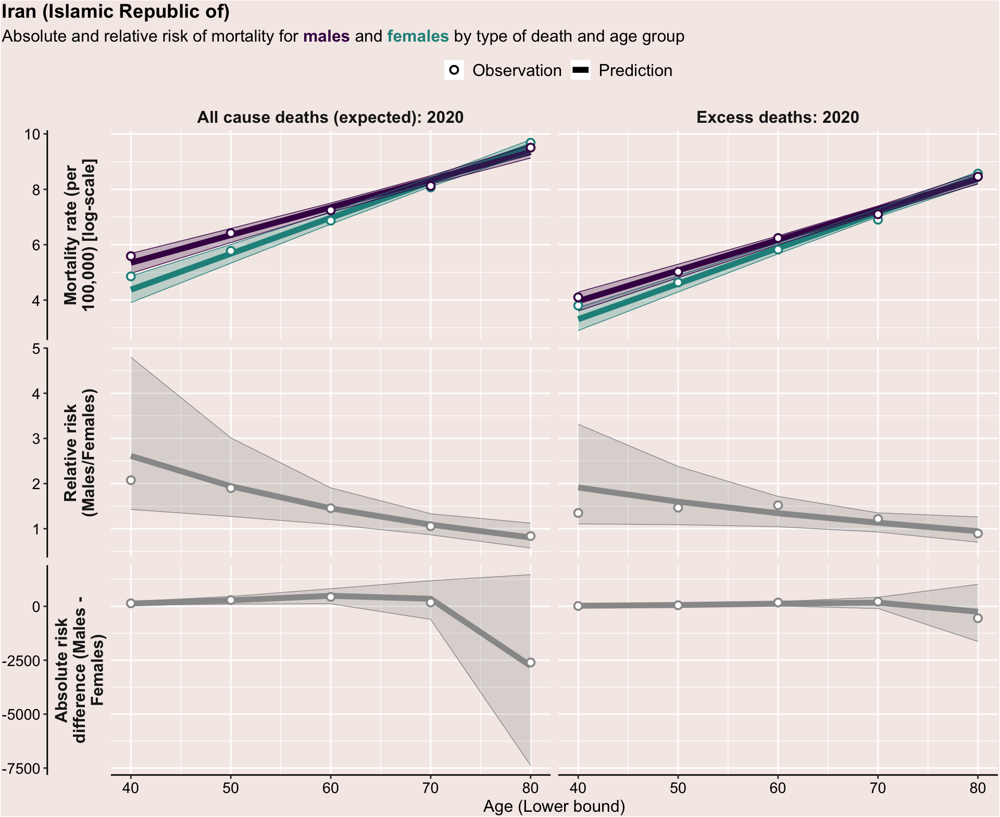{width=960}
:::


#### Spain 
- Total population: 47,233,572 
- Total official COVID deaths in 2020 (Our World in Data): 54,459 
- Total official COVID deaths in 2021  (Our World in Data): 37,229 
- Total excess deaths in 2020  (WHO): 75,201.66 
- Total excess deaths in 2021  (WHO): 32,336.08 

::: {.cell-output-display}
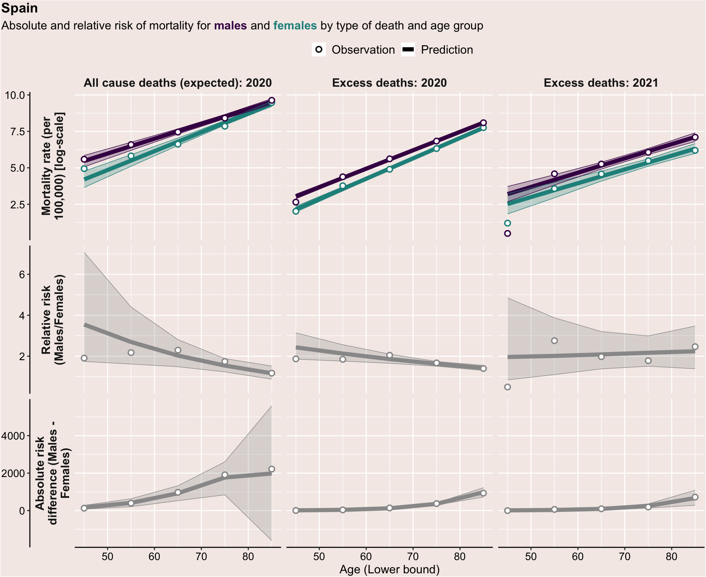{width=960}
:::


#### France 
- Total population: 64,291,311 
- Total official COVID deaths in 2020 (Our World in Data): 64,004 
- Total official COVID deaths in 2021  (Our World in Data): 56,958 
- Total excess deaths in 2020  (WHO): 50,200.12 
- Total excess deaths in 2021  (WHO): 37,445.36 

::: {.cell-output-display}
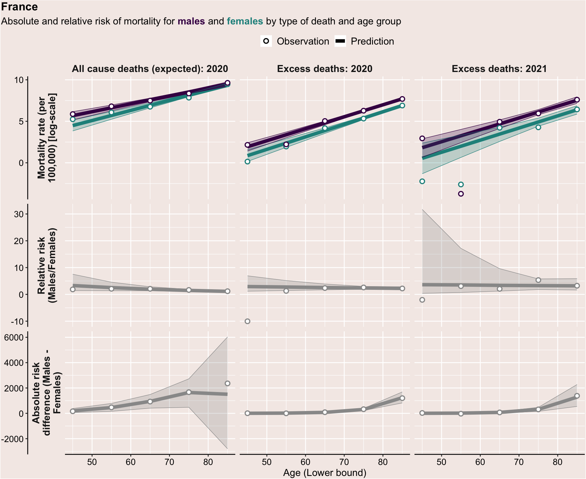{width=960}
:::


#### The United Kingdom 
- Total population: 66,921,778 
- Total official COVID deaths in 2020 (Our World in Data): 93,317 
- Total official COVID deaths in 2021  (Our World in Data): 83,496 
- Total excess deaths in 2020  (WHO): 81,734.67 
- Total excess deaths in 2021  (WHO): 65,350.31 

::: {.cell-output-display}
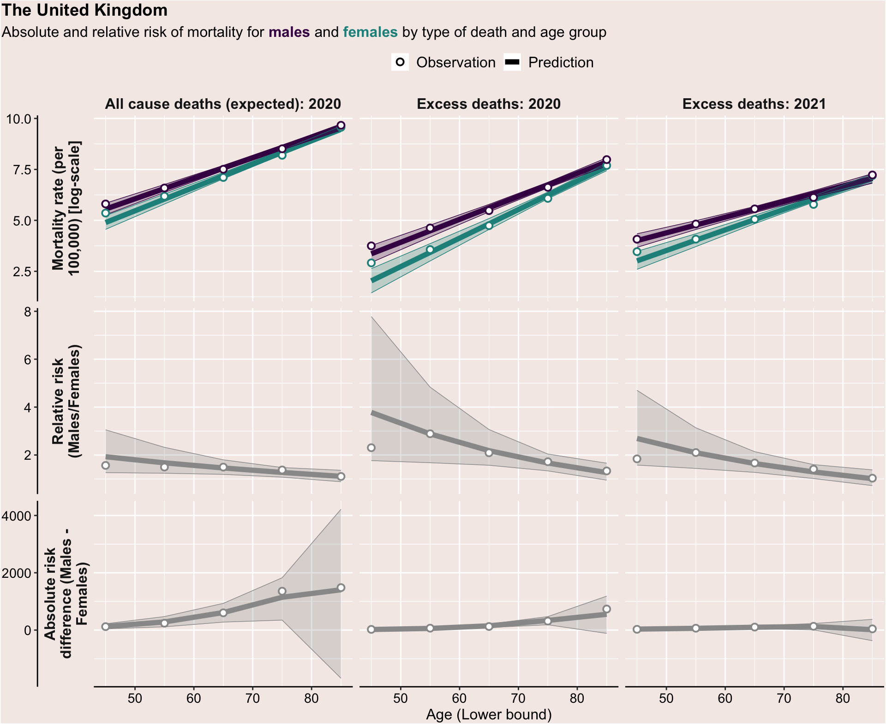{width=960}
:::


#### Georgia 
- Total population: 3,762,236 
- Total official COVID deaths in 2020 (Our World in Data): 2,505 
- Total official COVID deaths in 2021  (Our World in Data): 11,295 
- Total excess deaths in 2020  (WHO): 5,738.193 
- Total excess deaths in 2021  (WHO): 17,255.76 

::: {.cell-output-display}
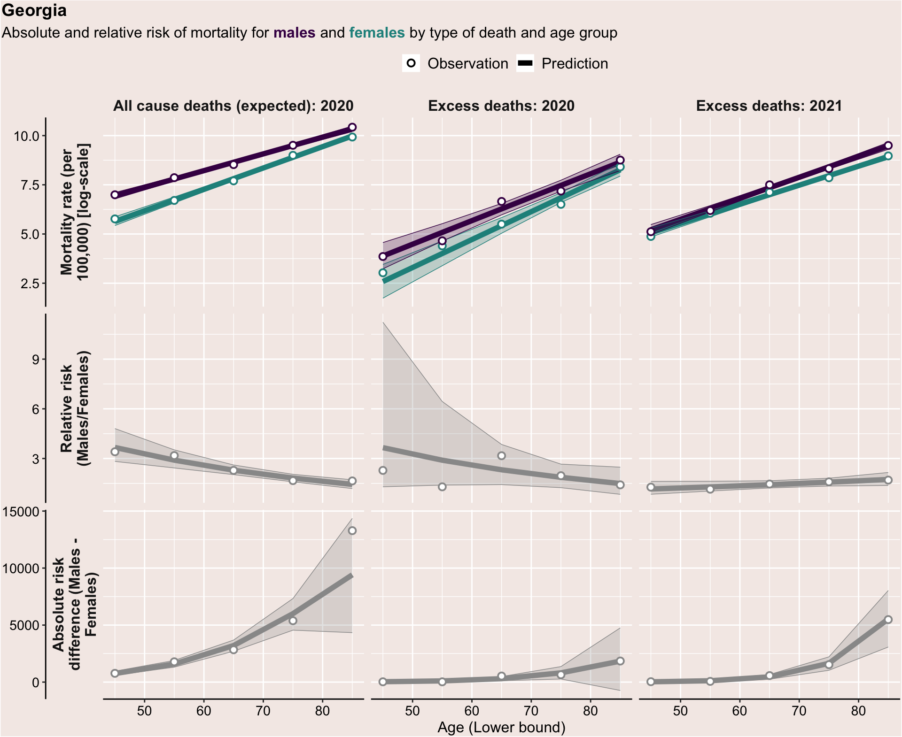{width=960}
:::


#### Greece 
- Total population: 10,484,757 
- Total official COVID deaths in 2020 (Our World in Data): 4,788 
- Total official COVID deaths in 2021  (Our World in Data): 15,920 
- Total excess deaths in 2020  (WHO): 7,277.952 
- Total excess deaths in 2021  (WHO): 19,485.75 

::: {.cell-output-display}
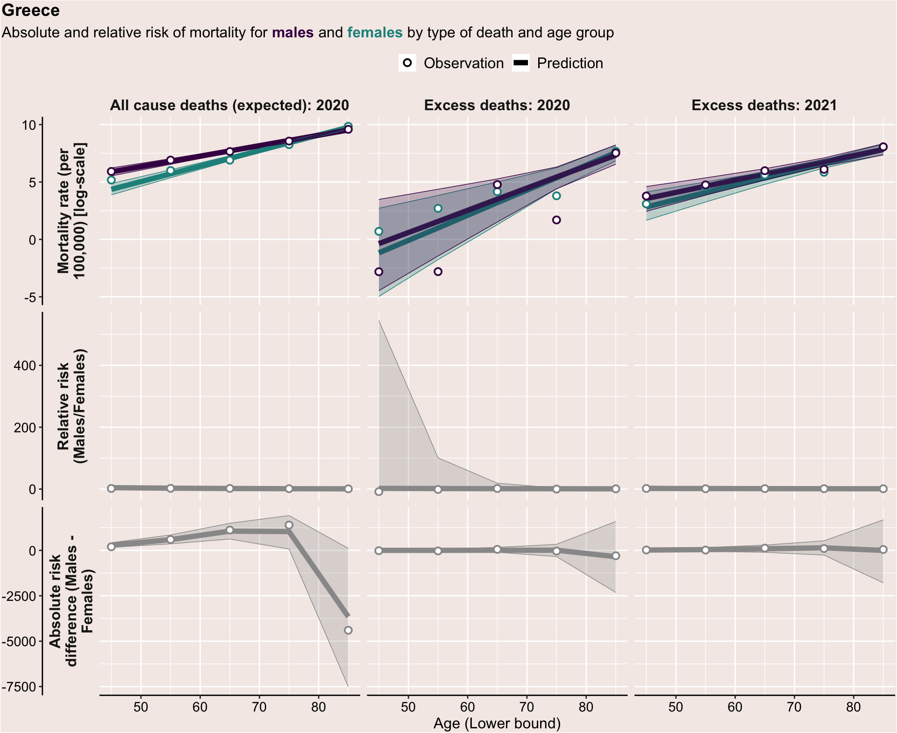{width=960}
:::


#### Guatemala 
- Total population: 17,355,773 
- Total official COVID deaths in 2020 (Our World in Data): 4,803 
- Total official COVID deaths in 2021  (Our World in Data): 11,299 
- Total excess deaths in 2020  (WHO): 12,580.13 
- Total excess deaths in 2021  (WHO): 36,476.57 

::: {.cell-output-display}
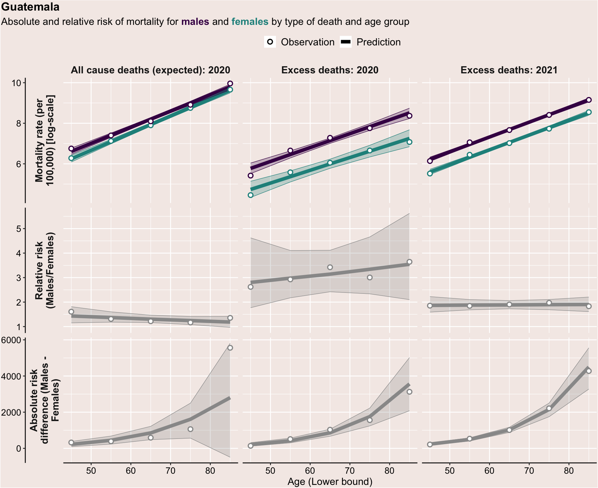{width=960}
:::


#### Croatia 
- Total population: 4,089,053 
- Total official COVID deaths in 2020 (Our World in Data): 3,860 
- Total official COVID deaths in 2021  (Our World in Data): 8,633 
- Total excess deaths in 2020  (WHO): 5,870.759 
- Total excess deaths in 2021  (WHO): 12,268.29 

::: {.cell-output-display}
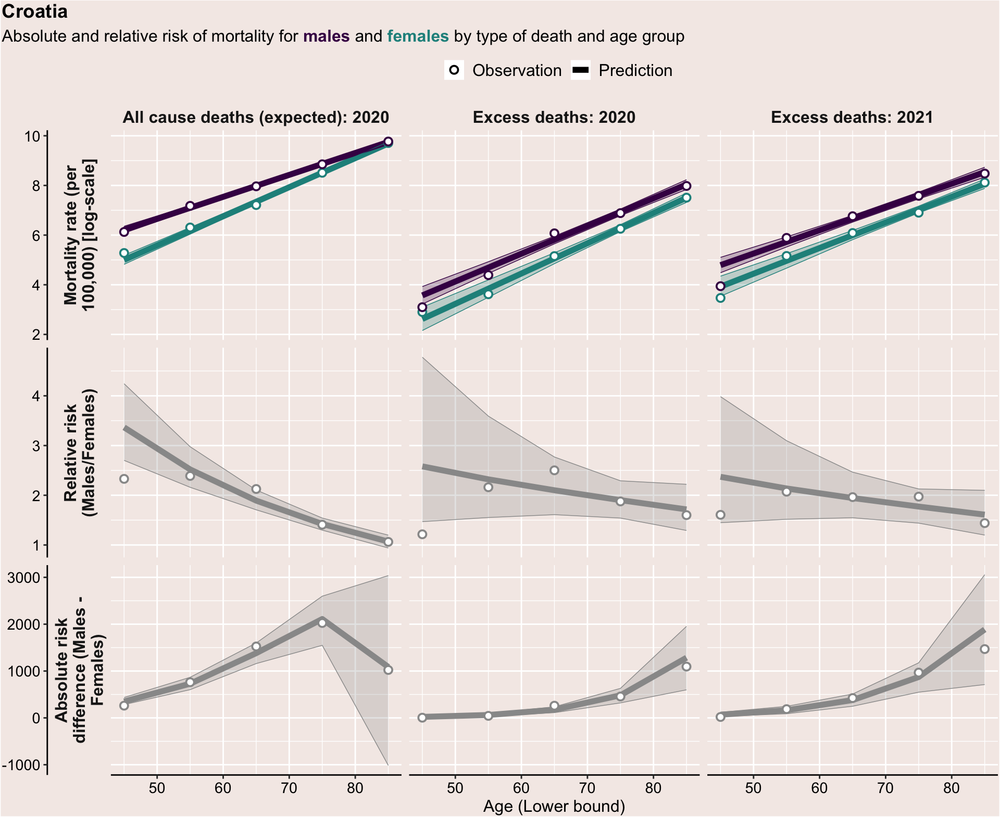{width=960}
:::


#### Hungary 
- Total population: 9,733,129 
- Total official COVID deaths in 2020 (Our World in Data): 9,537 
- Total official COVID deaths in 2021  (Our World in Data): 29,649 
- Total excess deaths in 2020  (WHO): 12,046.75 
- Total excess deaths in 2021  (WHO): 26,972.14 

::: {.cell-output-display}
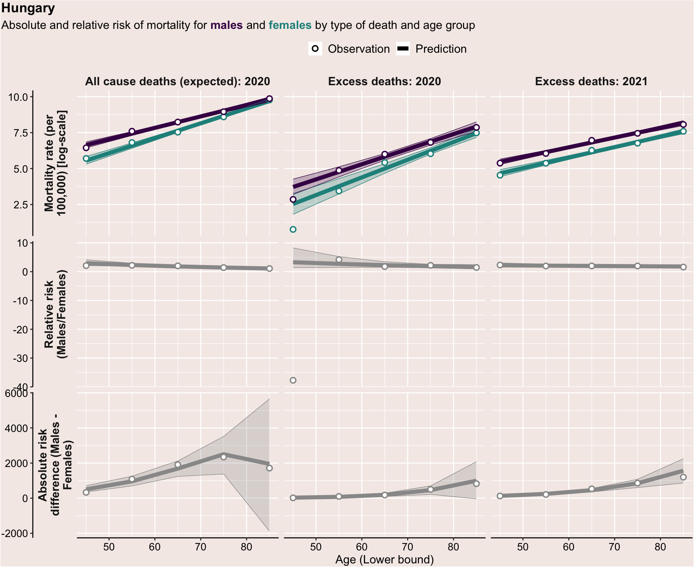{width=960}
:::


#### Ireland 
- Total population: 4,939,931 
- Total official COVID deaths in 2020 (Our World in Data): 2,265 
- Total official COVID deaths in 2021  (Our World in Data): 3,826 
- Total excess deaths in 2020  (WHO): 1,601.448 
- Total excess deaths in 2021  (WHO):  

::: {.cell-output-display}
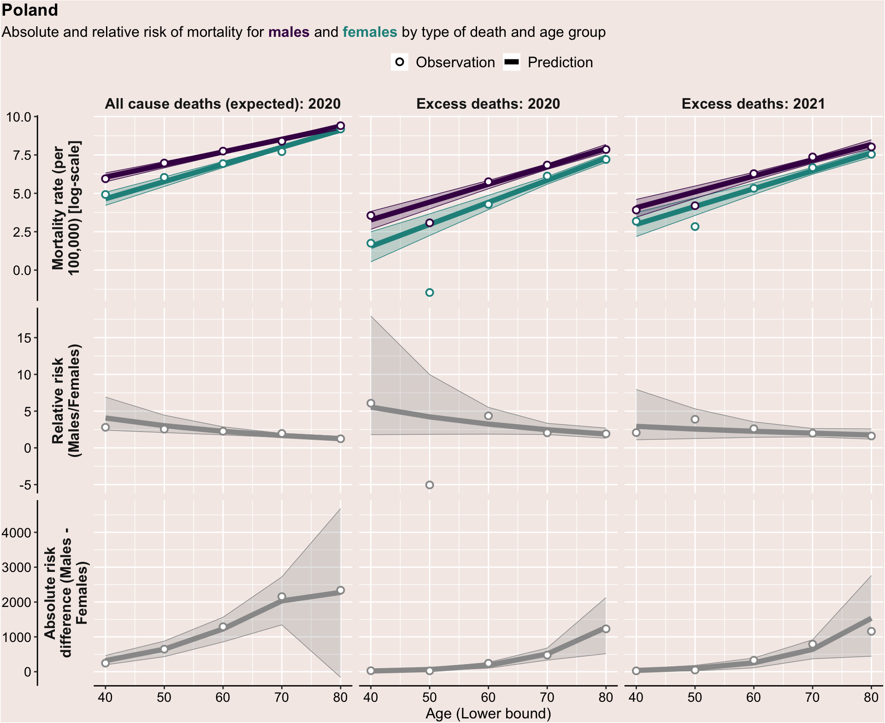{width=960}
:::


#### Iran (Islamic Republic of) 
- Total population: 87,266,417 
- Total official COVID deaths in 2020 (Our World in Data): 54,946 
- Total official COVID deaths in 2021  (Our World in Data): 76,581 
- Total excess deaths in 2020  (WHO): 136,293.9 
- Total excess deaths in 2021  (WHO): 159,238.4 

::: {.cell-output-display}
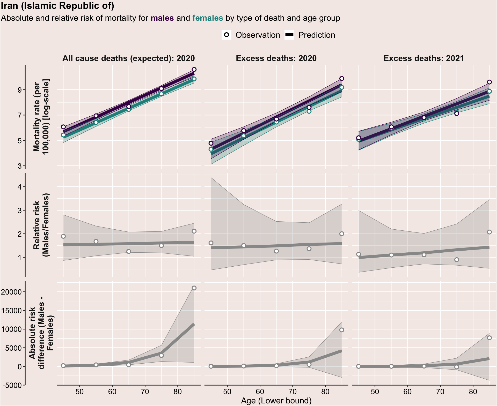{width=960}
:::


#### Iraq 
- Total population: 42,553,401 
- Total official COVID deaths in 2020 (Our World in Data): 12,800 
- Total official COVID deaths in 2021  (Our World in Data): 11,351 
- Total excess deaths in 2020  (WHO): 28,125.58 
- Total excess deaths in 2021  (WHO):  

::: {.cell-output-display}
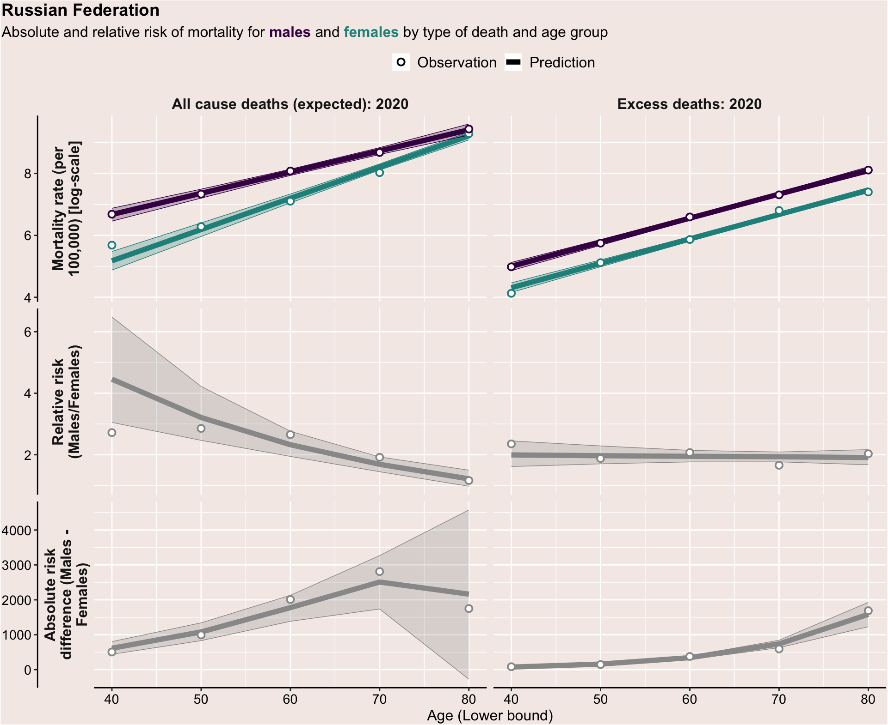{width=960}
:::


#### Israel 
- Total population: 8,746,610 
- Total official COVID deaths in 2020 (Our World in Data): 3,336 
- Total official COVID deaths in 2021  (Our World in Data): 4,923 
- Total excess deaths in 2020  (WHO): 3,177.944 
- Total excess deaths in 2021  (WHO): 4,795.487 

::: {.cell-output-display}
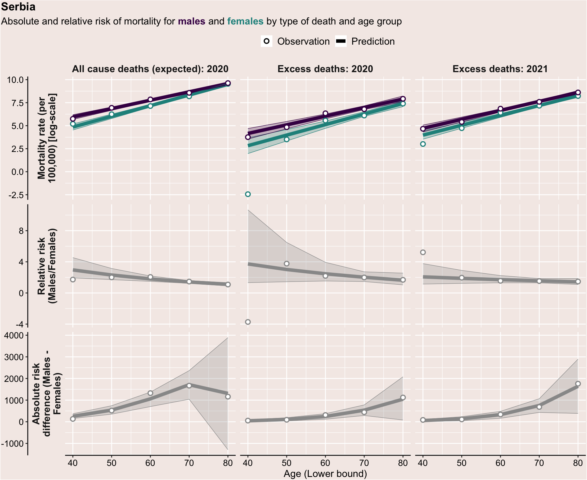{width=960}
:::


#### Italy 
- Total population: 59,314,503 
- Total official COVID deaths in 2020 (Our World in Data): 73,604 
- Total official COVID deaths in 2021  (Our World in Data): 63,643 
- Total excess deaths in 2020  (WHO): 109,157.4 
- Total excess deaths in 2021  (WHO): 75,106.86 

::: {.cell-output-display}
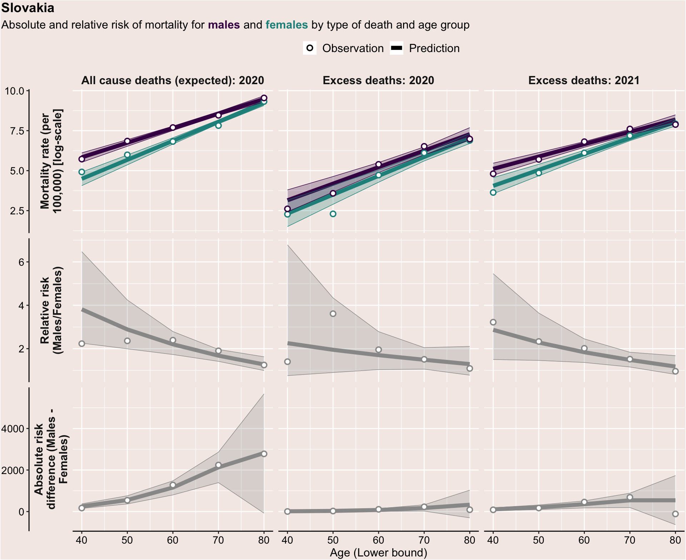{width=960}
:::


#### Japan 
- Total population: 124,706,807 
- Total official COVID deaths in 2020 (Our World in Data): 3,414 
- Total official COVID deaths in 2021  (Our World in Data): 14,979 
- Total excess deaths in 2020  (WHO): -21,921.16 
- Total excess deaths in 2021  (WHO): 22,117.4 

::: {.cell-output-display}
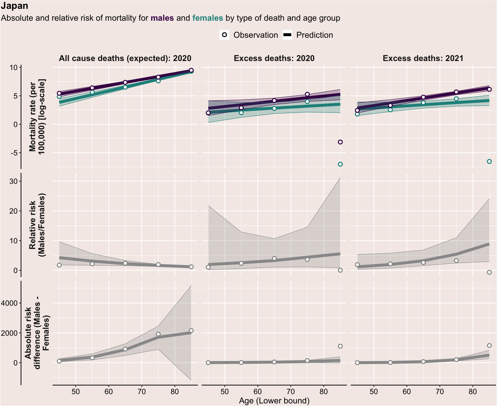{width=960}
:::


#### Kazakhstan 
- Total population: 18,973,597 
- Total official COVID deaths in 2020 (Our World in Data): 2,749 
- Total official COVID deaths in 2021  (Our World in Data): 15,478 
- Total excess deaths in 2020  (WHO): 31,218.43 
- Total excess deaths in 2021  (WHO): 52,050.25 

::: {.cell-output-display}
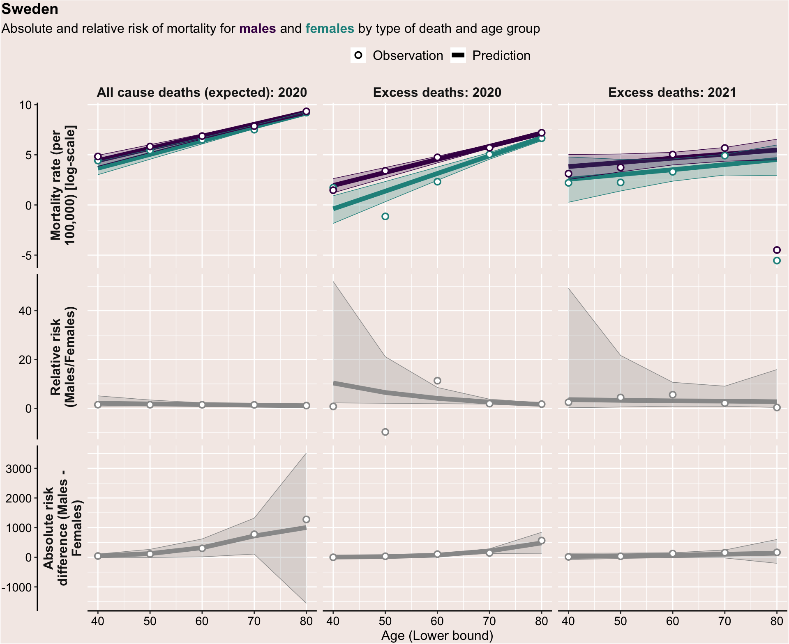{width=960}
:::


#### Republic of Moldova 
- Total population: 3,082,703 
- Total official COVID deaths in 2020 (Our World in Data): 3,110 
- Total official COVID deaths in 2021  (Our World in Data): 7,159 
- Total excess deaths in 2020  (WHO): 5,436.351 
- Total excess deaths in 2021  (WHO): 10,905.46 

::: {.cell-output-display}
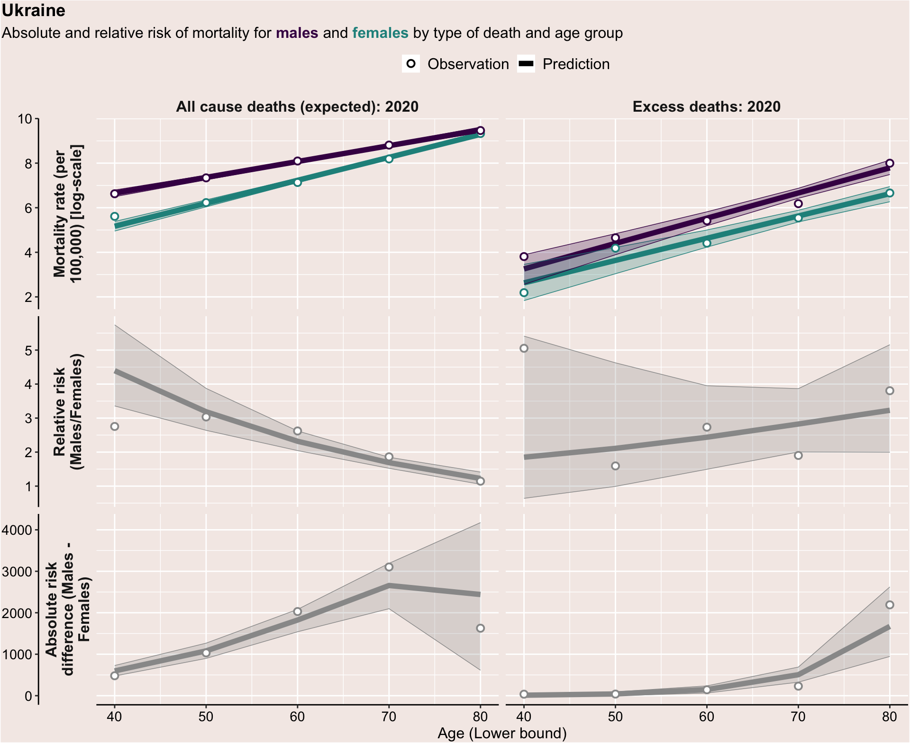{width=960}
:::


#### Mexico 
- Total population: 125,917,904 
- Total official COVID deaths in 2020 (Our World in Data): 147,623 
- Total official COVID deaths in 2021  (Our World in Data): 156,199 
- Total excess deaths in 2020  (WHO): 297,154 
- Total excess deaths in 2021  (WHO): 315,216 

::: {.cell-output-display}
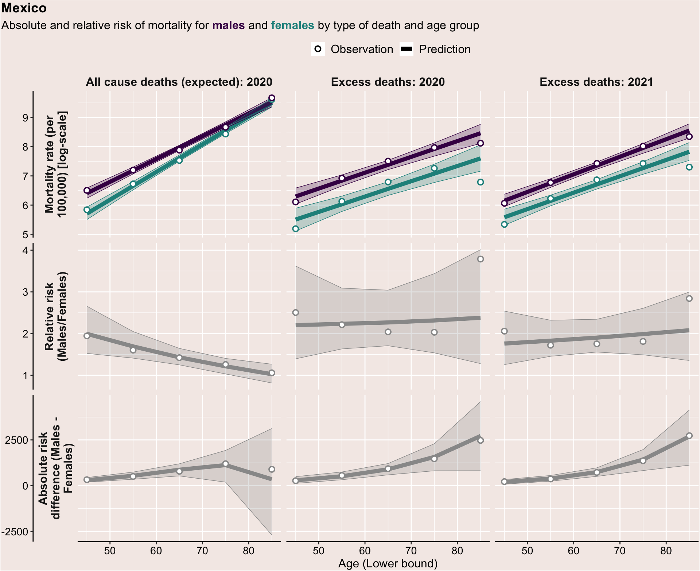{width=960}
:::


#### Netherlands 
- Total population: 17,403,110 
- Total official COVID deaths in 2020 (Our World in Data): 11,296 
- Total official COVID deaths in 2021  (Our World in Data): 9,589 
- Total excess deaths in 2020  (WHO): 14,530.01 
- Total excess deaths in 2021  (WHO): 16,001.69 

::: {.cell-output-display}
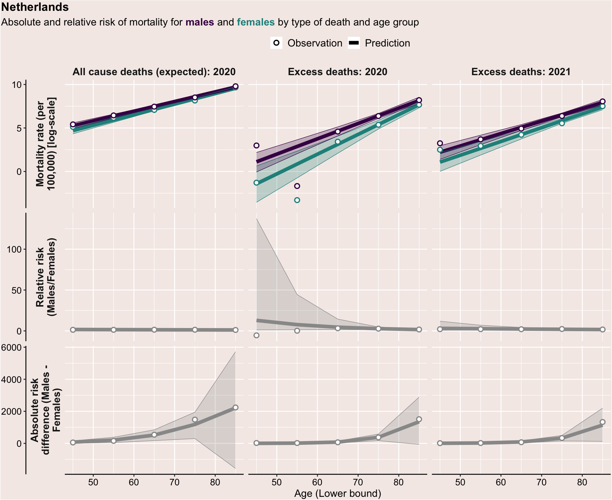{width=960}
:::


#### Panama 
- Total population: 4,291,548 
- Total official COVID deaths in 2020 (Our World in Data): 3,933 
- Total official COVID deaths in 2021  (Our World in Data): 3,492 
- Total excess deaths in 2020  (WHO): 2,861.276 
- Total excess deaths in 2021  (WHO):  

::: {.cell-output-display}
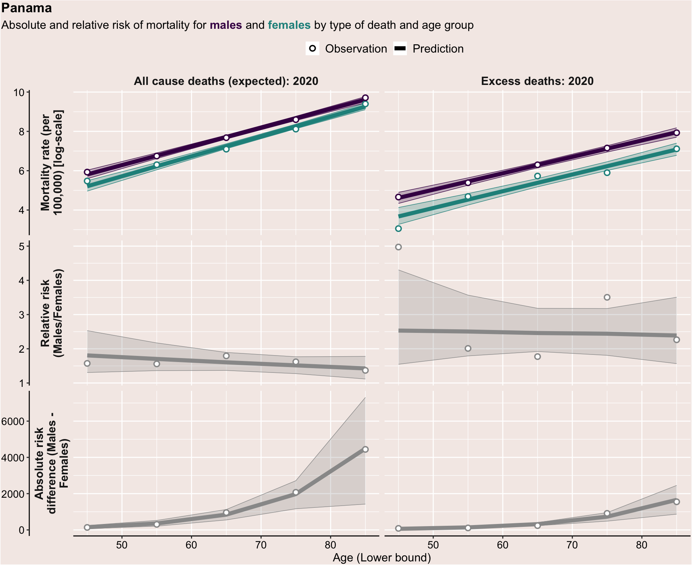{width=960}
:::


#### Peru 
- Total population: 33,290,096 
- Total official COVID deaths in 2020 (Our World in Data): 93,066 
- Total official COVID deaths in 2021  (Our World in Data): 109,518 
- Total excess deaths in 2020  (WHO): 100,106.6 
- Total excess deaths in 2021  (WHO): 124,084.2 

::: {.cell-output-display}
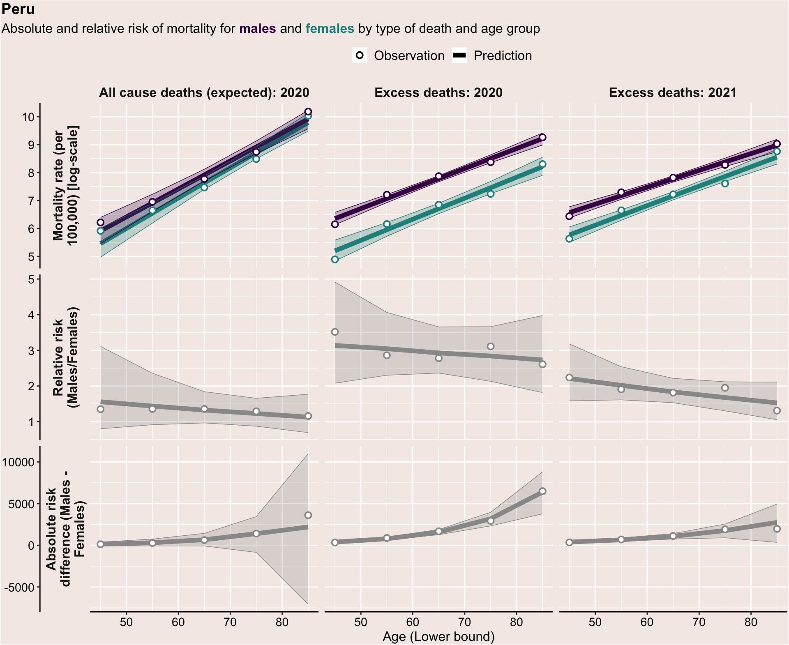{width=960}
:::


#### Poland 
- Total population: 38,358,520 
- Total official COVID deaths in 2020 (Our World in Data): 28,642 
- Total official COVID deaths in 2021  (Our World in Data): 68,416 
- Total excess deaths in 2020  (WHO): 63,032.16 
- Total excess deaths in 2021  (WHO): 100,112.2 

::: {.cell-output-display}
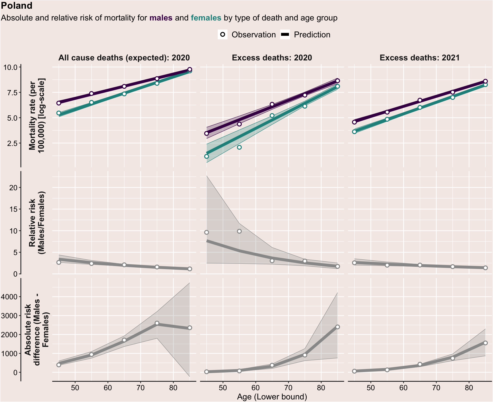{width=960}
:::


#### Portugal 
- Total population: 10,274,559 
- Total official COVID deaths in 2020 (Our World in Data): 6,842 
- Total official COVID deaths in 2021  (Our World in Data): 12,095 
- Total excess deaths in 2020  (WHO): 11,245.03 
- Total excess deaths in 2021  (WHO): 12,245.21 

::: {.cell-output-display}
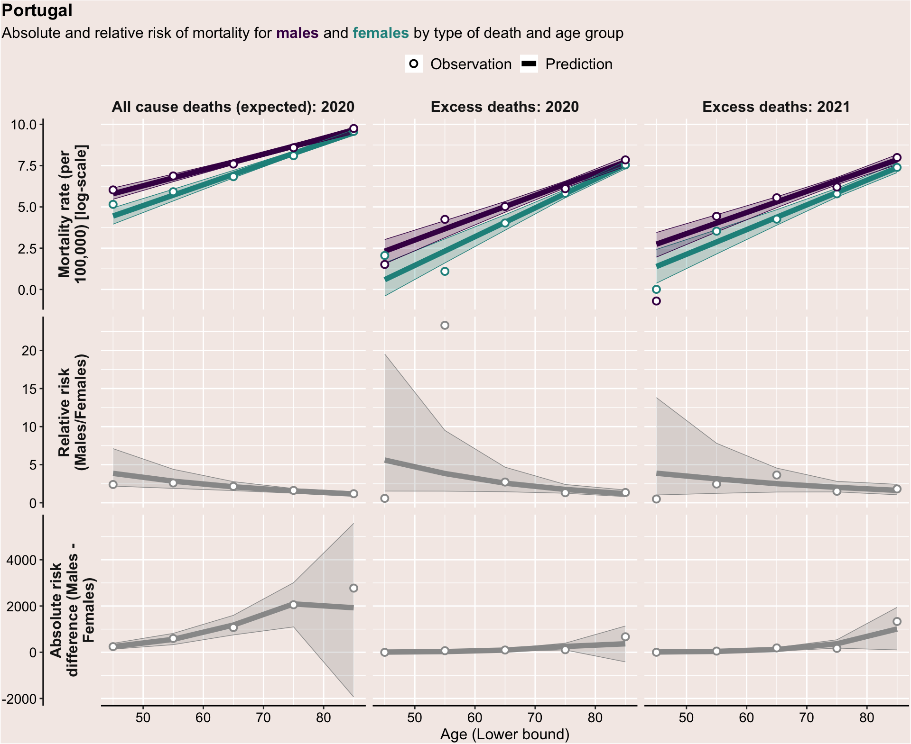{width=960}
:::


#### Paraguay 
- Total population: 6,615,894 
- Total official COVID deaths in 2020 (Our World in Data): 2,220 
- Total official COVID deaths in 2021  (Our World in Data): 14,404 
- Total excess deaths in 2020  (WHO): 1,423.428 
- Total excess deaths in 2021  (WHO): 18,371.62 

::: {.cell-output-display}
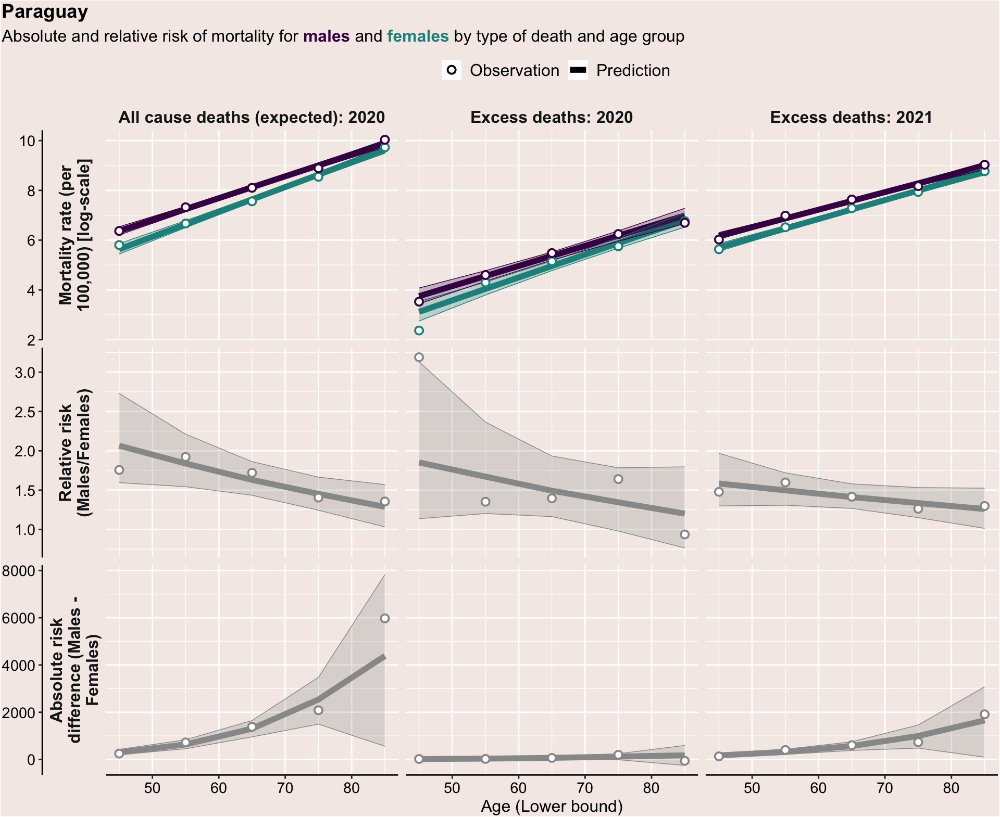{width=960}
:::


#### Romania 
- Total population: 19,411,764 
- Total official COVID deaths in 2020 (Our World in Data): 15,596 
- Total official COVID deaths in 2021  (Our World in Data): 43,118 
- Total excess deaths in 2020  (WHO): 37,164.14 
- Total excess deaths in 2021  (WHO): 76,235.53 

::: {.cell-output-display}
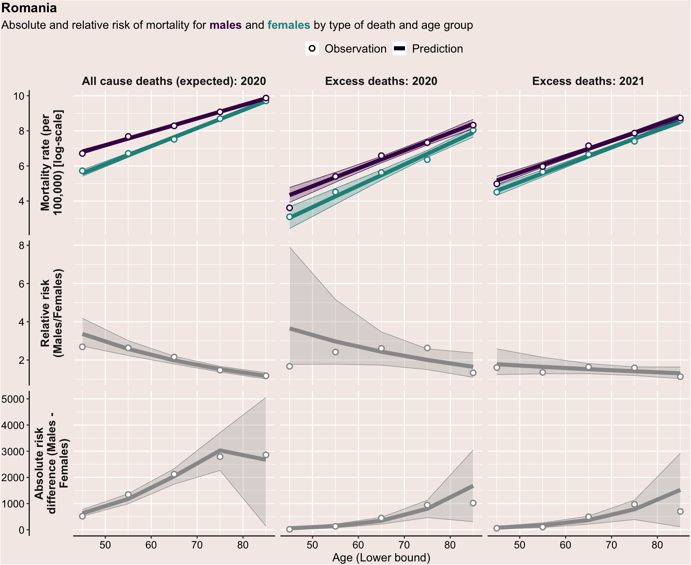{width=960}
:::


#### Russian Federation 
- Total population: 145,420,443 
- Total official COVID deaths in 2020 (Our World in Data): 57,019 
- Total official COVID deaths in 2021  (Our World in Data): 251,841 
- Total excess deaths in 2020  (WHO): 380,136.8 
- Total excess deaths in 2021  (WHO): 713,027.8 

::: {.cell-output-display}
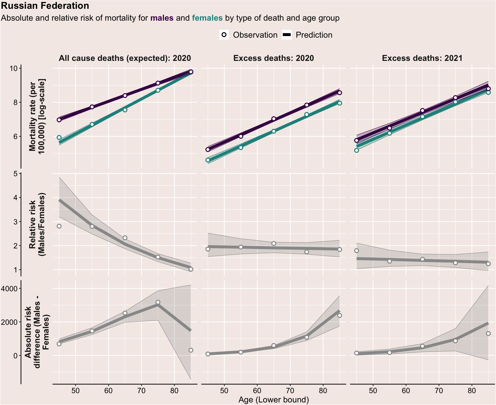{width=960}
:::


#### Serbia 
- Total population: 7,347,278 
- Total official COVID deaths in 2020 (Our World in Data): 3,163 
- Total official COVID deaths in 2021  (Our World in Data): 9,525 
- Total excess deaths in 2020  (WHO): 16,724.08 
- Total excess deaths in 2021  (WHO): 36,442.32 

::: {.cell-output-display}
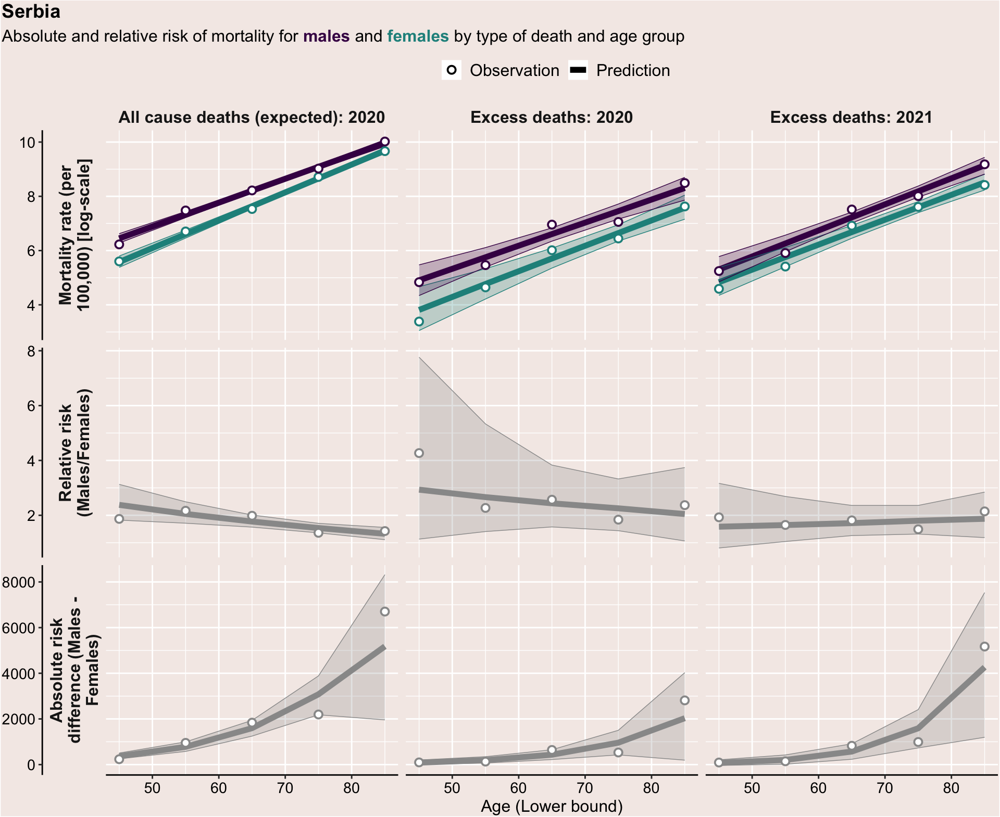{width=960}
:::


#### Slovakia 
- Total population: 5,449,592 
- Total official COVID deaths in 2020 (Our World in Data): 2,138 
- Total official COVID deaths in 2021  (Our World in Data): 14,497 
- Total excess deaths in 2020  (WHO): 5,849.537 
- Total excess deaths in 2021  (WHO): 20,291.01 

::: {.cell-output-display}
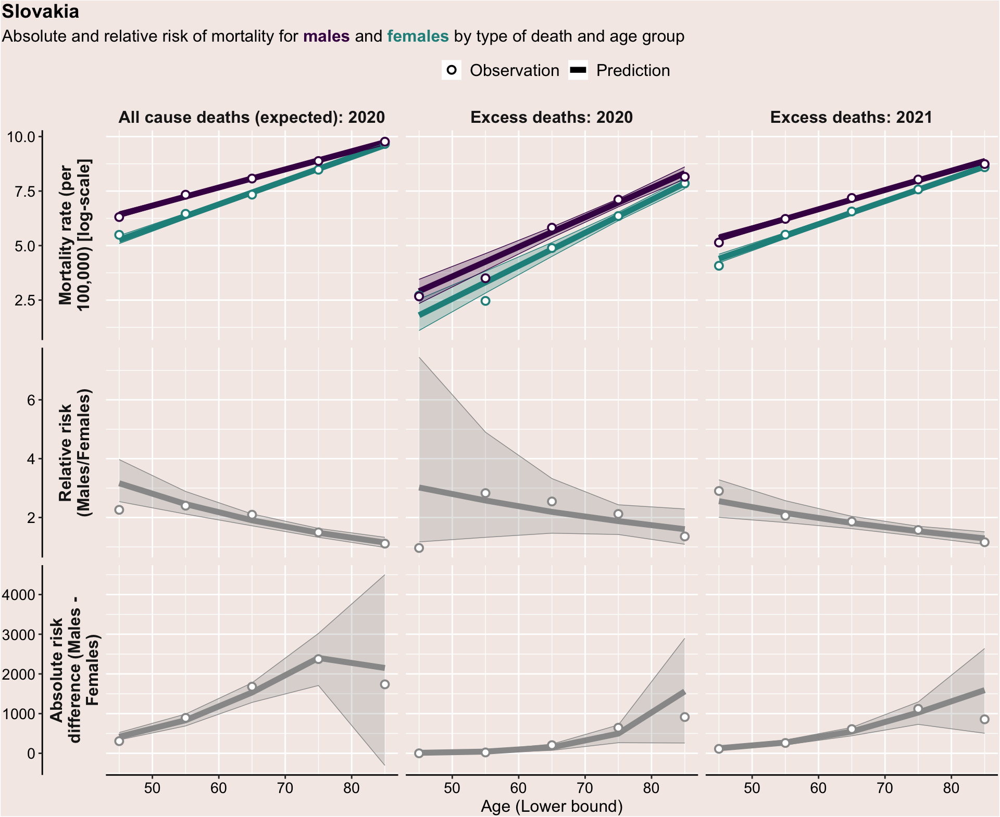{width=960}
:::


#### Slovenia 
- Total population: 2,113,213 
- Total official COVID deaths in 2020 (Our World in Data): 2,981 
- Total official COVID deaths in 2021  (Our World in Data): 3,139 
- Total excess deaths in 2020  (WHO): 1,317.898 
- Total excess deaths in 2021  (WHO): 241.1147 

::: {.cell-output-display}
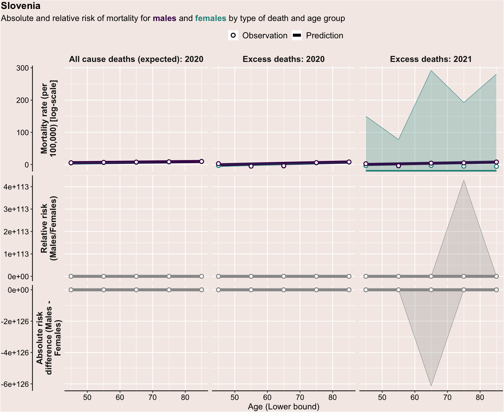{width=960}
:::


#### Sweden 
- Total population: 10,347,118 
- Total official COVID deaths in 2020 (Our World in Data): 9,706 
- Total official COVID deaths in 2021  (Our World in Data): 5,639 
- Total excess deaths in 2020  (WHO): 8,932.776 
- Total excess deaths in 2021  (WHO): 3,273.921 

::: {.cell-output-display}
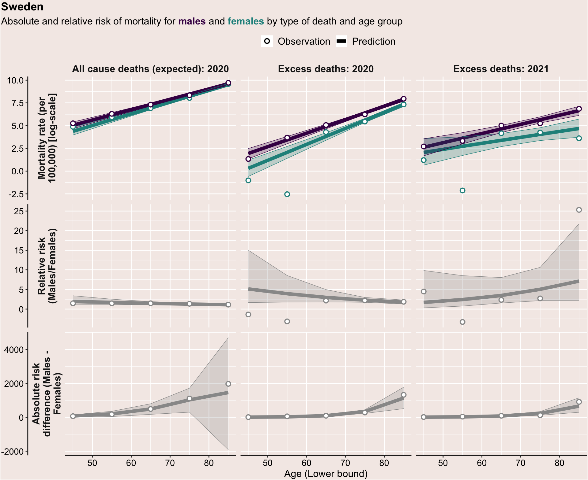{width=960}
:::


#### Tunisia 
- Total population: 12,156,148 
- Total official COVID deaths in 2020 (Our World in Data): 4,620 
- Total official COVID deaths in 2021  (Our World in Data): 20,944 
- Total excess deaths in 2020  (WHO): 4,322.457 
- Total excess deaths in 2021  (WHO):  

::: {.cell-output-display}
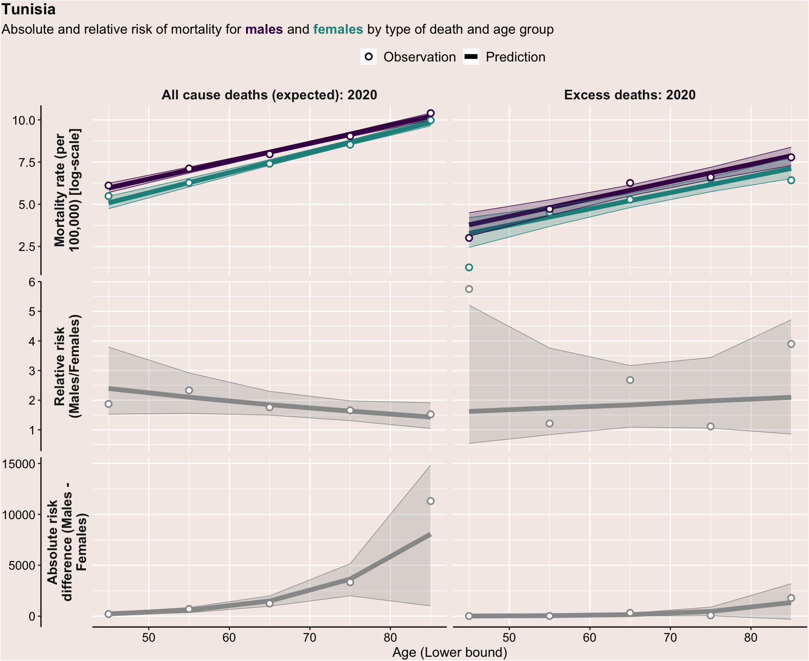{width=960}
:::


#### Ukraine 
- Total population: 43,843,015 
- Total official COVID deaths in 2020 (Our World in Data): 18,533 
- Total official COVID deaths in 2021  (Our World in Data): 77,366 
- Total excess deaths in 2020  (WHO): 43,125.64 
- Total excess deaths in 2021  (WHO): 144,710.5 

::: {.cell-output-display}
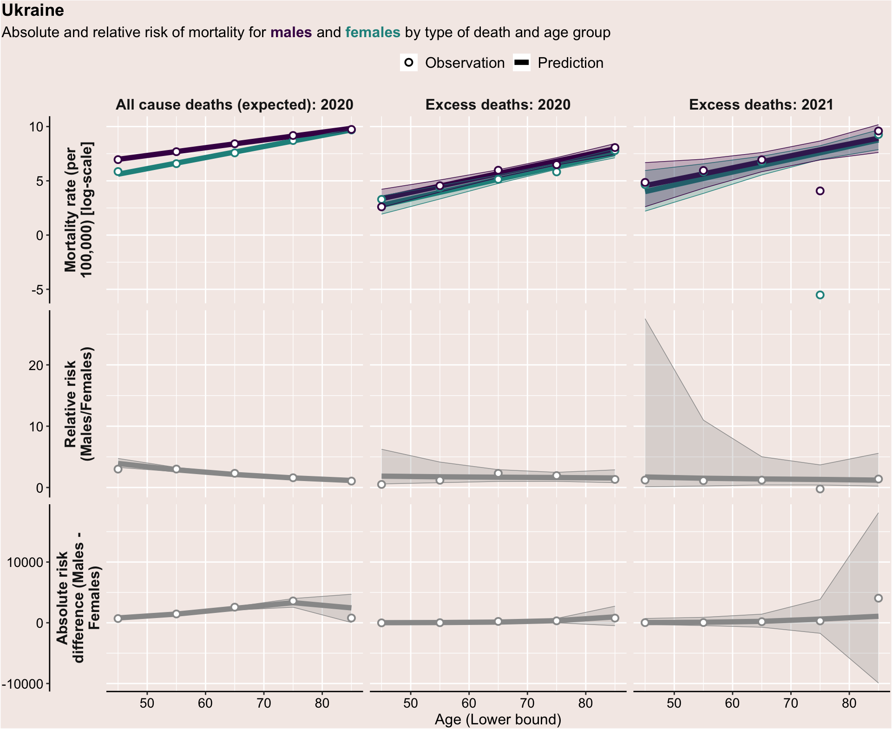{width=960}
:::


#### USA 
- Total population: 335,410,796 
- Total official COVID deaths in 2020 (Our World in Data): 352,004 
- Total official COVID deaths in 2021  (Our World in Data): 467,051 
- Total excess deaths in 2020  (WHO): 467,312.8 
- Total excess deaths in 2021  (WHO): 501,112.5 

::: {.cell-output-display}
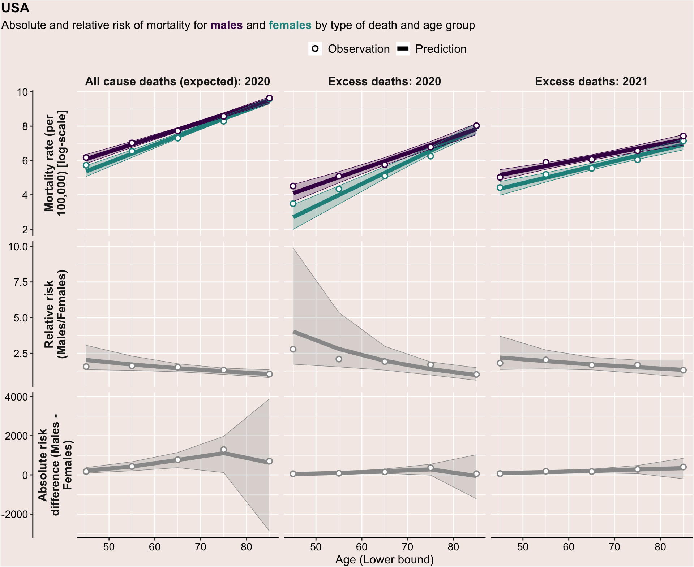{width=960}
:::


#### South Africa 
- Total population: 58,778,516 
- Total official COVID deaths in 2020 (Our World in Data): 28,033 
- Total official COVID deaths in 2021  (Our World in Data): 63,028 
- Total excess deaths in 2020  (WHO): 56,967.63 
- Total excess deaths in 2021  (WHO): 189,834.3 

::: {.cell-output-display}
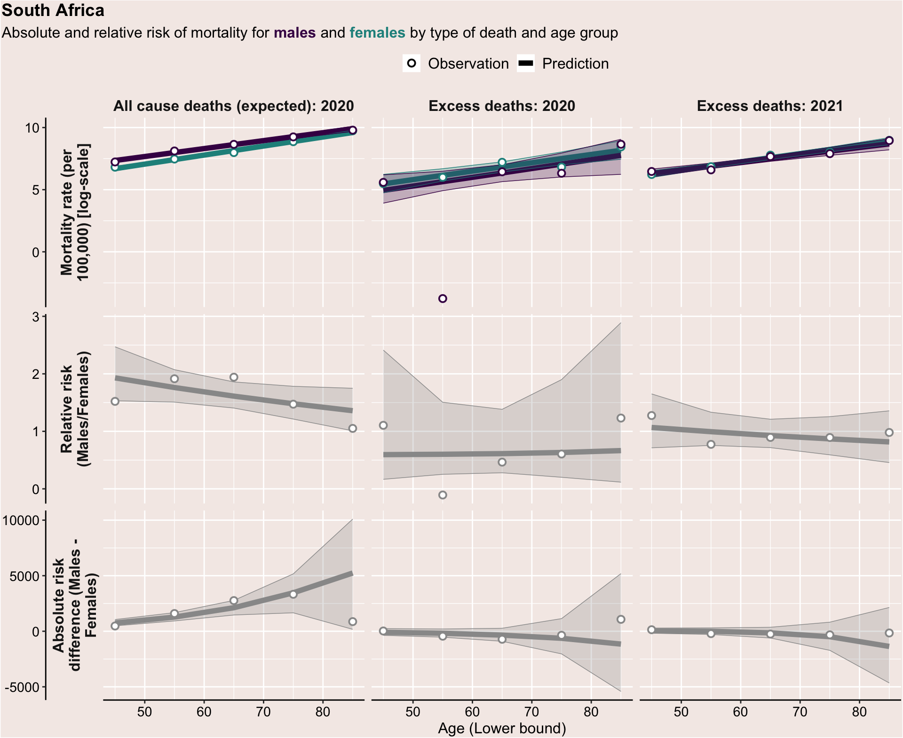{width=960}
:::
:::


<!-- ### Poisson regression coefficients  -->

<!-- #### Unadjusted model -->
<!-- ```{r fig.width = 10, fig.asp = 1.5} -->
<!-- #| echo: false -->
<!-- #| warning: false -->

<!-- visualize_coeffs(model_results, models = "1. Unadjusted model (Deaths ~ a + b*male)") -->

<!-- ``` -->

<!-- #### Age-adjusted model (no interaction) -->
<!-- ```{r fig.width = 10, fig.asp = 1.5} -->
<!-- #| echo: false -->
<!-- #| warning: false -->

<!-- visualize_coeffs(model_results, models = "2. Adjusted model (Deaths ~ a + b*male + c*age)") -->

<!-- ``` -->


<!-- ### Relationship between sex-differences in mortality and country income -->

<!-- #### Mortality rates -->

<!-- ##### Observations -->
<!-- ```{r fig.width = 10, fig.asp = 0.818} -->
<!-- #| echo: false -->
<!-- #| warning: false -->

<!-- caption <- str_wrap( -->
<!--   paste0("Source: Author's calculations using WHO excess death estimates by sex.  -->
<!--          Notes: Each point represents the observed mortality rate for men and women for each country/age-group combination. Observed excess mortality rates less than 0 are recoded to 1. Only countries with actual all cause-deaths in 2020 available for both men and women by age are used."),  -->
<!--   115) -->

<!-- plot_data_v_income(obs_to_plot, slct_metric = "Mortality rate (per 100,000) [log-scale]", group_data = NULL, income_data = income, caption) -->

<!-- ``` -->

<!-- ##### Predictions -->
<!-- ```{r fig.width = 10, fig.asp = 0.818} -->
<!-- #| echo: false -->
<!-- #| warning: false -->
<!-- #|  -->
<!-- caption <- str_wrap( -->
<!--   paste0("Source: Author's calculations using WHO excess death estimates by sex.  -->
<!--          Notes: Each point represents the median predicted mortality rate for men and women at each age for a single country from a simulation of 1,000 parameter draws from a Poisson model Only countries with actual all cause-deaths in 2020 available for both men and women by age are used."),  -->
<!--   115) -->

<!-- plot_data_v_income(simsummary_to_plot, slct_metric = "Mortality rate (per 100,000) [log-scale]", income_data = income, group_data = NULL, caption) -->

<!-- ``` -->

<!-- #### Sex-ratio in mortality rates -->

<!-- ##### Observations -->
<!-- ```{r fig.width = 10, fig.asp = 0.818} -->
<!-- #| echo: false -->

<!-- caption <- str_wrap( -->
<!--   paste0("Source: Author's calculations using WHO excess death estimates by sex.  -->
<!--          Notes: In cases where negative excess mortality rates are less than 0 for men or women, those values are recoded to 1. Observed sex ratios greater than 20 are recoded to 20. Each point represents the observed relative risk of mortality between men and women for a single country/age-group combination. Only countries with actual all cause-deaths in 2020 available for both men and women by age are used."),  -->
<!--   115) -->

<!-- plot_data_v_income(obs_to_plot, slct_metric = "Relative risk (Males/Females)", income_data = income, group_data = NULL, caption) -->


<!-- ``` -->

<!-- ##### Predictions -->
<!-- ```{r fig.width = 10, fig.asp = 0.818} -->
<!-- #| echo: false -->

<!-- caption <- str_wrap( -->
<!--   paste0("Source: Author's calculations using WHO excess death estimates by sex.  -->
<!--          Notes: Each point represents the median predicted relative risk of mortality between men and women for a single country from a simulation of 1,000 parameter draws from a Poisson model. Only countries with actual all cause-deaths in 2020 available for both men and women by age are used."),  -->
<!--   115) -->

<!-- plot_data_v_income(simsummary_to_plot, slct_metric = "Relative risk (Males/Females)", income_data = income, group_data = NULL, caption) -->


<!-- ``` -->

<!-- #### Sex-gap in mortality rates -->

<!-- ##### Observations -->
<!-- ```{r fig.width = 10, fig.asp = 0.818} -->
<!-- #| echo: false -->

<!-- caption <- str_wrap( -->
<!--   paste0("Source: Author's calculations using WHO excess death estimates by sex.  -->
<!--          Notes: Each point represents the observed difference in mortality between men and women for a single country/age-group. Only countries with actual all cause-deaths in 2020 available for both men and women by age are used."),  -->
<!--   115) -->
<!-- plot_data_v_income(obs_to_plot, slct_metric = "Absolute risk difference (Males - Females)", income_data = income, group_data = NULL, caption) -->

<!-- ``` -->

<!-- ##### Predictions -->
<!-- ```{r fig.width = 10, fig.asp = 0.818} -->
<!-- #| echo: false -->

<!-- caption <- str_wrap( -->
<!--   paste0("Source: Author's calculations using WHO excess death estimates by sex.  -->
<!--          Notes: Each point represents the median predicted risk difference of mortality between men and women for a single country/age-group from a simulation of 1,000 parameter draws from a Poisson model. Only countries with actual all cause-deaths in 2020 available for both men and women by age are used."),  -->
<!--   115) -->
<!-- plot_data_v_income(simsummary_to_plot, slct_metric = "Absolute risk difference (Males - Females)", income_data = income, group_data = NULL, caption) -->

<!-- ``` -->

